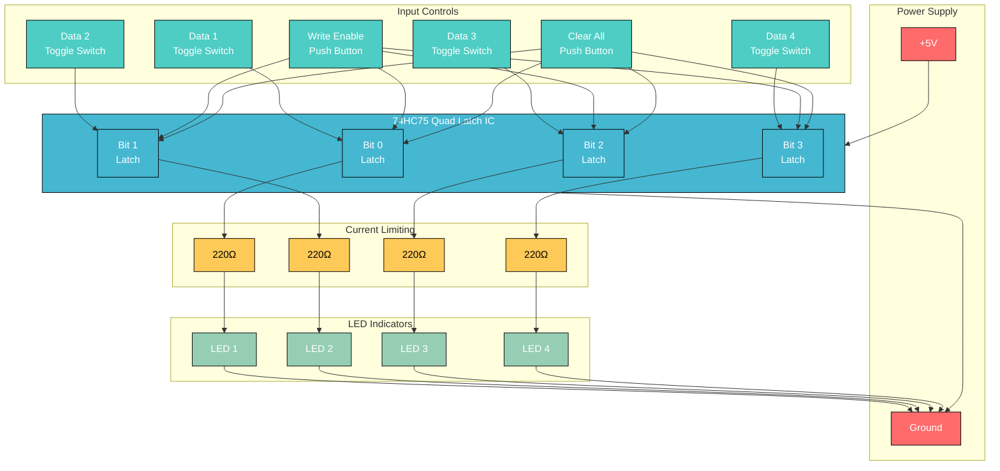

# 4-Bit Memory Circuit - MVP Design

A practical digital memory circuit you can build on a breadboard to demonstrate how computers store bits.

## Circuit Diagram



## Components List

### Main Components
- **1x 74HC75** (Quad D-Type Latch) - Main memory IC
- **4x SPDT Toggle Switches** (Data inputs)
- **1x Momentary Push Button** (Write Enable)
- **1x Momentary Push Button** (Clear/Reset)
- **4x Red LEDs** (Visual output)
- **4x 220Ω Resistors** (Current limiting)
- **2x 10kΩ Resistors** (Pull-up/Pull-down)

### Build Materials  
- **1x Large Breadboard**
- **1x 5V Power Supply** (USB adapter or battery pack)
- **Jumper wires** (various colors)
- **Wire strippers**

## Pin Connections - 74HC75

```
74HC75 Pinout:
 1 - Clear 1&2    16 - VCC (+5V)
 2 - Data 1       15 - Clear 3&4  
 3 - Data 2       14 - Data 4
 4 - Enable 1&2   13 - Data 3
 5 - Enable 3&4   12 - Enable 3&4
 6 - Q2           11 - Q4
 7 - Q1           10 - Q3
 8 - GND           9 - Q3 (inverted)
```

## Build Steps

1. **Power the IC**: Connect Pin 16 to +5V, Pin 8 to Ground
2. **Data Inputs**: Connect toggle switches to pins 2, 3, 13, 14
3. **Enable Control**: Connect Write button to pins 4, 5, 12 (with 10kΩ pull-down resistor)
4. **Clear Control**: Connect Clear button to pins 1, 15 (with 10kΩ pull-up resistor)  
5. **LED Outputs**: Connect LEDs through 220Ω resistors to pins 7, 6, 10, 11
6. **Ground LEDs**: Connect LED cathodes to ground rail

## How to Test

### Write Operation
1. Set toggle switches to desired 4-bit pattern (e.g., 1010)
2. Press Write Enable button
3. LEDs should illuminate according to switch pattern
4. Change switches - LEDs should NOT change (memory is holding data!)

### Memory Persistence Test
1. Write a pattern (e.g., 1100) 
2. Turn off all input switches (0000)
3. Memory should retain original pattern (LEDs show 1100)
4. Demonstrates that **state persists** independently of input

### Clear Test
1. Press Clear button
2. All LEDs should turn OFF
3. All stored bits reset to 0000

### Read Test
1. Use voltmeter/logic probe on output pins (7, 6, 10, 11)
2. High voltage (≈5V) = Stored bit is 1
3. Low voltage (≈0V) = Stored bit is 0

## Expected Behavior Table

| Operation | Data Switches | Write Enable | LEDs Show | Memory Contains |
|-----------|---------------|--------------|-----------|-----------------|
| Write 1010| 1-0-1-0       | Press        | 1-0-1-0   | 1010           |
| Hold      | 0-0-0-0       | Don't press  | 1-0-1-0   | 1010 (held!)   |
| Write 1111| 1-1-1-1       | Press        | 1-1-1-1   | 1111           |
| Clear     | Any           | Press Clear  | 0-0-0-0   | 0000           |

## Troubleshooting

- **LEDs don't light**: Check power connections and LED polarity
- **Memory doesn't hold**: Verify Write Enable connections to pins 4, 5, 12
- **Random behavior**: Add 0.1μF decoupling capacitor between VCC and GND near IC
- **Can't clear**: Check Clear button pull-up resistor connection
- **Partial operation**: Check individual data line connections

## What You're Learning

This circuit demonstrates:

- **Bistable Memory**: Each latch maintains one of two stable states
- **Data Persistence**: Information is stored even when inputs change  
- **Write Control**: Data only updates when explicitly commanded
- **Visual Feedback**: LEDs provide immediate indication of stored state
- **Digital Storage Foundation**: Same principle used in RAM and registers

## Extensions

- **8-bit version**: Use two 74HC75 ICs for 8-bit memory
- **Address decoding**: Add logic to select which bits to write
- **Data bus**: Connect to microcontroller for automatic control
- **Larger memory**: Cascade multiple ICs for 16, 32+ bits
- **Read/Write indicators**: Add LEDs to show operation status

## Theory Behind the Circuit

Each latch in the 74HC75 is essentially a **bistable circuit** - it can exist in one of two stable states:
- **State 1**: Output HIGH (LED ON) = Bit value 1
- **State 2**: Output LOW (LED OFF) = Bit value 0

When Write Enable is pressed, the current input data "overwrites" the stored state. When Write Enable is released, the latch "remembers" the last written value through internal positive feedback - the same principle used in all digital memory systems.

**This is fundamentally how your computer's RAM works** - millions of these bistable storage elements, each holding one bit of information!
