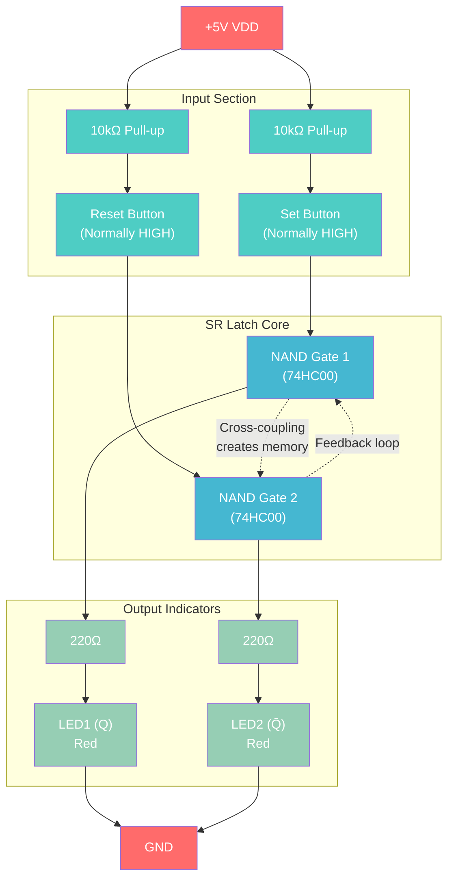

# SR Latch MVP Projects - Digital Memory Fundamentals

A collection of hands-on projects to learn Set-Reset (SR) latches - the fundamental building blocks of digital memory.

## Why SR Latches Matter

SR latches are the foundation of all digital memory systems. Understanding them helps you grasp how computers store information at the most basic level. These projects bridge the gap between logic gates and complex memory systems like RAM.

## Project 1: Basic NAND SR Latch

### Circuit Diagram



**Truth Table:**
| Set | Reset | Q (LED1) | Q̄ (LED2) | State |
|-----|-------|----------|-----------|-------|
| 1 | 1 | Previous | Previous | Hold |
| 0 | 1 | 1 | 0 | Set |
| 1 | 0 | 0 | 1 | Reset |
| 0 | 0 | 1 | 1 | Forbidden |

### Components Required

| Component | Quantity | Source | Part Number | Price |
|-----------|----------|--------|-------------|-------|
| 74HC00 (Quad NAND) | 1 | Rapid Electronics | SN74HC00N | £0.32 |
| Push Buttons | 2 | ELEGOO Kit | Tactile switches | Included |
| LEDs (Red) | 2 | ELEGOO Kit | 5mm LEDs | Included |
| 220Ω Resistors | 2 | ELEGOO Kit | Current limiting | Included |
| 10kΩ Resistors | 2 | ELEGOO Kit | Pull-up | Included |
| Breadboard | 1 | ELEGOO Kit | 830-point | Included |
| Jumper Wires | Various | ELEGOO Kit | Male-male | Included |

**Total additional cost: £0.32** (assuming you have the ELEGOO kit)

### Build Instructions

1. **Power Setup**
   - Connect +5V to breadboard power rail
   - Connect GND to breadboard ground rail

2. **IC Placement**
   - Insert 74HC00 into breadboard center
   - Connect Pin 14 to +5V, Pin 7 to GND

3. **NAND Gate Connections**
   - Use gates 1 and 2 of the 74HC00
   - Gate 1: Pins 1,2 (inputs) → Pin 3 (output)
   - Gate 2: Pins 4,5 (inputs) → Pin 6 (output)

4. **Cross-Coupling**
   - Connect Gate 1 output (Pin 3) to Gate 2 input (Pin 5)
   - Connect Gate 2 output (Pin 6) to Gate 1 input (Pin 2)

5. **Input Connections**
   - Connect Set button to Gate 1 input (Pin 1) via 10kΩ pull-up
   - Connect Reset button to Gate 2 input (Pin 4) via 10kΩ pull-up

6. **Output Indicators**
   - Connect Gate 1 output to LED1 via 220Ω resistor
   - Connect Gate 2 output to LED2 via 220Ω resistor

### Testing Procedure

| Action | Set Button | Reset Button | LED1 (Q) | LED2 (Q̄) | State |
|--------|------------|--------------|----------|-----------|-------|
| Initial | Released | Released | ? | ? | Random |
| Press Set | Pressed | Released | ON | OFF | Set |
| Release Set | Released | Released | ON | OFF | Latched |
| Press Reset | Released | Pressed | OFF | ON | Reset |
| Release Reset | Released | Released | OFF | ON | Latched |
| Press Both | Pressed | Pressed | ON | ON | Forbidden |

### Learning Outcomes

- **Bistable Operation**: Two stable states that persist
- **Memory Effect**: State maintained after input removed
- **Cross-Coupling**: How feedback creates memory
- **Forbidden State**: Both outputs HIGH (invalid)

## Project 2: Switch Debounce Circuit

### The Problem

Mechanical switches "bounce" - they make and break contact multiple times when pressed, creating multiple false signals.

### Solution: SR Latch Debouncer

```
SPDT Switch ─── Common
             ├─── NC contact ──── Set input (via resistor)
             └─── NO contact ──── Reset input (via resistor)

Connect to basic SR latch from Project 1
```

### Components Required

| Component | Quantity | Source | Part Number | Price |
|-----------|----------|--------|-------------|-------|
| SR Latch Circuit | 1 | From Project 1 | - | £0.32 |
| SPDT Toggle Switch | 1 | Silicon Ark | MS244 | £1.50 |
| 1kΩ Resistors | 2 | ELEGOO Kit | Current limiting | Included |

**Additional cost: £1.50**

### Demonstration

1. **Without Debouncer**: Connect switch directly to counter circuit - observe multiple counts per switch action
2. **With Debouncer**: Route switch through SR latch - observe clean single transitions

### Applications

- Keyboard input processing
- Control panel switches
- Any mechanical interface requiring clean digital signals

## Project 3: Simple Memory Cell

### Enhanced SR Latch with Write Enable

```
Data Input ──┐
             ├─── AND1 ──── Set
Write Enable─┘       
             ┌─── AND2 ──── Reset
Data Input ──┴─── NOT ────┘
             (inverted)

Connect Set/Reset to basic SR latch
```

### Components Required

| Component | Quantity | Source | Part Number | Price |
|-----------|----------|--------|-------------|-------|
| 74HC08 (Quad AND) | 1 | Rapid Electronics | CD74HC08E | £0.41 |
| 74HC04 (Hex NOT) | 1 | Rapid Electronics | SN74HC04N | £0.35 |
| SR Latch Circuit | 1 | From Project 1 | - | £0.32 |

**Additional cost: £1.08**

### Operation

- **Write Enable LOW**: Memory retains current state
- **Write Enable HIGH + Data HIGH**: Writes 1 to memory
- **Write Enable HIGH + Data LOW**: Writes 0 to memory

### Testing

| Write Enable | Data Input | Memory Output | Action |
|--------------|------------|---------------|--------|
| 0 | X | Previous | Hold |
| 1 | 0 | 0 | Write 0 |
| 1 | 1 | 1 | Write 1 |
| 0 | X | Unchanged | Hold |

## Project 4: Traffic Light State Machine

### Advanced Project

Uses multiple SR latches to remember the current traffic light state.

### Components Required

| Component | Quantity | Source | Price |
|-----------|----------|--------|-------|
| 74HC00 (NAND gates) | 2 | Rapid Electronics | £0.64 |
| 555 Timer IC | 1 | ELEGOO Kit | Included |
| LEDs (Red, Yellow, Green) | 3 sets | ELEGOO Kit | Included |
| Resistors & Capacitors | Various | ELEGOO Kit | Included |

### States

1. **Red**: Cars stop, stored in Latch 1
2. **Red+Yellow**: Prepare to go, stored in Latch 2  
3. **Green**: Cars go, stored in Latch 3
4. **Yellow**: Prepare to stop, stored in Latch 4

### Operation

Timer advances through states:
Red → Red+Yellow → Green → Yellow → Red...

Each state change sets one latch and resets others.

## Component Shopping Summary

### From Rapid Electronics
- 1x SN74HC00N (NAND): £0.32
- 1x CD74HC08E (AND): £0.41
- 1x SN74HC04N (NOT): £0.35
- **Subtotal: £1.08**

### From Silicon Ark
- 1x MS244 (Toggle Switch): £1.50

### From ELEGOO Kit
- Breadboard, LEDs, resistors, push buttons, jumper wires, power supply

### Total Investment
- **Basic SR Latch**: £0.32
- **With Debouncer**: £1.82
- **Memory Cell**: £2.90
- **Traffic Light**: £4-6 depending on components

## Learning Path

1. **Start with Project 1**: Understand basic SR latch operation
2. **Add Project 2**: See practical application (debouncing)
3. **Build Project 3**: Learn controlled memory writing
4. **Attempt Project 4**: Apply to real-world state machine

## Next Steps

After mastering SR latches:
- **D Flip-Flops**: Edge-triggered memory
- **JK Flip-Flops**: Enhanced functionality
- **Counters**: Sequential memory systems
- **74HC75 Quad Latch**: Multiple bits of memory
- **Simple Computer**: CPU with memory system

## Troubleshooting

### Common Issues

**LEDs don't light**: Check power connections and LED polarity
**Random behavior**: Add 0.1µF capacitor between VCC and GND near IC
**Won't latch**: Verify cross-coupling connections between NAND gates
**Both LEDs on**: Normal for forbidden state; check input connections

### Design Notes

- **NAND implementation**: Most common due to fewer transistors
- **Power consumption**: CMOS draws current only during switching
- **Speed**: 74HC family propagation delay ~10ns
- **Fan-out**: Can drive multiple inputs (typically 10+ gates)

## References

- **74HC00 Datasheet**: Texas Instruments SN74HC00N
- **Digital Design Principles**: Wakerly, 4th Edition
- **Art of Electronics**: Horowitz & Hill, Chapter 10

---

*This project series builds practical understanding of digital memory from first principles. Each project adds complexity while reinforcing core concepts.*
