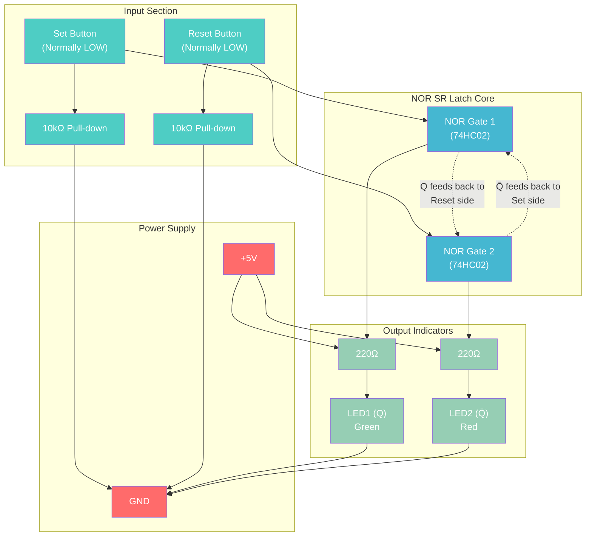
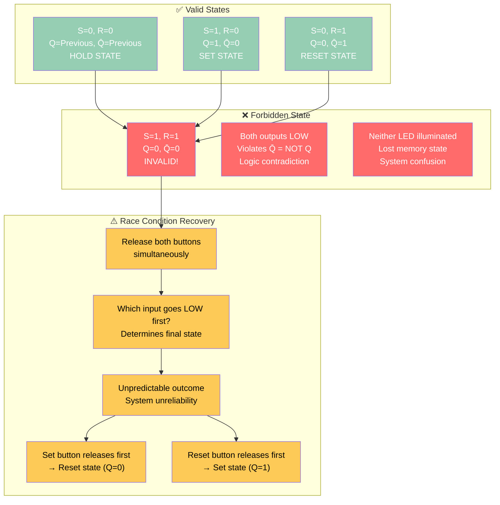

# NOR SR Latch Tutorial - Invalid State Demonstration

A comprehensive tutorial on NOR-based Set-Reset latches, including hands-on demonstration of the forbidden state and race conditions.

## NOR vs NAND SR Latches

**Key Difference:**

- **NAND SR Latch**: Active LOW inputs (press button = logic 0)

- **NOR SR Latch**: Active HIGH inputs (press button = logic 1) - more intuitive!

## Basic NOR SR Latch Circuit

### Circuit Diagram



### Components Required

| Component | Quantity | Source | Part Number | Price |
|-----------|----------|--------|-------------|-------|
| 74HC02 (Quad NOR) | 1 | Rapid Electronics | SN74HC02N | £0.27 |
| Push Buttons | 2 | ELEGOO Kit | Tactile switches | Included |
| LEDs (Green/Red) | 2 | ELEGOO Kit | 5mm LEDs | Included |
| 220Ω Resistors | 2 | ELEGOO Kit | Current limiting | Included |
| 10kΩ Resistors | 2 | ELEGOO Kit | Pull-down | Included |
| Breadboard | 1 | ELEGOO Kit | 830-point | Included |

**Total additional cost: £0.27**

## Truth Table Analysis

### Normal Operation

| Set (S) | Reset (R) | Q (LED1) | Q̄ (LED2) | State | Action |
|---------|-----------|----------|-----------|-------|--------|
| 0 | 0 | Previous | Previous | **Hold** | Memory maintained |
| 1 | 0 | 1 | 0 | **Set** | Store logic 1 |
| 0 | 1 | 0 | 1 | **Reset** | Store logic 0 |
| **1** | **1** | **0** | **0** | **⚠️ Invalid** | **Forbidden state** |

## Invalid State Demonstration

### The Problem: S=1, R=1

When both Set and Reset are HIGH simultaneously, both NOR gate outputs go LOW, creating an impossible state where Q=0 and Q̄=0.



## Experimental Procedure

### Step 1: Build the Circuit

1. Insert 74HC02 into breadboard

2. Connect power (Pin 14 = +5V, Pin 7 = GND)

3. Wire NOR gates with cross-coupling

4. Add pull-down resistors to buttons

5. Connect LEDs with current limiting resistors

### Step 2: Normal Operation Test

1. **Hold State**: Both buttons released → LEDs maintain previous state

2. **Set Operation**: Press Set button → Green LED ON, Red LED OFF

3. **Reset Operation**: Press Reset button → Green LED OFF, Red LED ON

4. **Memory Test**: Change button states → observe persistence

### Step 3: Invalid State Demonstration

**Creating the Forbidden State:**

1. Press and hold **both Set and Reset buttons**

2. **Observe**: Both LEDs turn OFF (Q=0, Q̄=0)

3. **Problem identified**: This violates basic logic principles

**Race Condition Experiment:**

1. While holding both buttons, release them simultaneously

2. **Repeat 10 times** and record final states

3. **Expected result**: Unpredictable outcomes

4. Sometimes ends in Set state, sometimes Reset state

**Controlled Recovery:**

1. Create invalid state again (both buttons pressed)

2. Release **only Set button** → should go to Reset state (Red LED)

3. Create invalid state again  

4. Release **only Reset button** → should go to Set state (Green LED)

### Step 4: Timing Analysis

**Why Race Conditions Occur:**

- Button release timing varies by microseconds

- First button to release determines final state

- Creates non-deterministic behavior

- Unacceptable in reliable digital systems

## Build Instructions

### Pin Connections for 74HC02

```

74HC02 NOR Gate Pinout:

 1 - Input A1     14 - VDD (+5V)

 2 - Input B1     13 - Input B4

 3 - Output 1     12 - Input A4  

 4 - Output 2     11 - Output 4

 5 - Input A2     10 - Input B3

 6 - Input B2      9 - Input A3

 7 - GND           8 - Output 3

```

### Detailed Wiring

1. **Power**: Pin 14 to +5V rail, Pin 7 to GND rail

2. **NOR Gate 1** (Set side):

   - Input A1 (Pin 1): Set button via pull-down resistor

   - Input B1 (Pin 2): Q̄ feedback from NOR Gate 2 output

   - Output 1 (Pin 3): Q output to Green LED and NOR Gate 2 input

3. **NOR Gate 2** (Reset side):

   - Input A2 (Pin 5): Reset button via pull-down resistor  

   - Input B2 (Pin 6): Q feedback from NOR Gate 1 output

   - Output 2 (Pin 4): Q̄ output to Red LED and NOR Gate 1 input

4. **LEDs**:

   - Green LED: +5V → 220Ω → LED → Q output (Pin 3)

   - Red LED: +5V → 220Ω → LED → Q̄ output (Pin 4)

5. **Buttons**:

   - Set: One side to +5V, other to Pin 1 and 10kΩ to GND

   - Reset: One side to +5V, other to Pin 5 and 10kΩ to GND

## Comparison: NAND vs NOR SR Latches

| Aspect | NAND SR Latch | NOR SR Latch |
|--------|---------------|--------------|
| **Active Level** | LOW (button press = 0) | HIGH (button press = 1) |
| **Normal Inputs** | S=1, R=1 (both HIGH) | S=0, R=0 (both LOW) |
| **Set Command** | S=0, R=1 | S=1, R=0 |
| **Reset Command** | S=1, R=0 | S=0, R=1 |
| **Invalid State** | S=0, R=0 (both LOW) | S=1, R=1 (both HIGH) |
| **Invalid Output** | Q=1, Q̄=1 (both HIGH) | Q=0, Q̄=0 (both LOW) |
| **Intuitive?** | Less (inverted logic) | More (direct logic) |

## Why This Matters

### Design Implications

- **System reliability**: Invalid states cause unpredictable behavior

- **Timing critical**: Race conditions create non-deterministic outcomes

- **Design rules**: Must prevent simultaneous Set/Reset in real systems

### Solutions in Practice

1. **Clocked flip-flops**: Use clock edges to avoid timing issues

2. **JK flip-flops**: Convert invalid state to toggle operation

3. **D flip-flops**: Single input eliminates conflicting commands

4. **Enable logic**: Use additional gates to prevent invalid combinations

### Real-World Applications

- **Memory controllers**: Prevent data corruption

- **State machines**: Ensure predictable state transitions  

- **Safety systems**: Avoid undefined behaviors in critical applications

## Troubleshooting

### Common Issues

- **LEDs don't respond**: Check power connections and pull-down resistors

- **Random behavior**: Verify cross-coupling connections between NOR gates

- **Won't hold state**: Ensure feedback paths are properly connected

- **Invalid state not visible**: Confirm both buttons can reach +5V simultaneously

### Measurement Points

- **Logic high**: ~5V (LED ON)

- **Logic low**: ~0V (LED OFF)

- **Invalid state**: Both outputs at 0V

- **Race recovery**: Rapid voltage transitions during button release

## Learning Outcomes

After completing this tutorial, you will understand:

- **NOR-based memory implementation**

- **Active HIGH vs active LOW logic**

- **Forbidden states and their consequences**

- **Race conditions in digital systems**

- **Why advanced flip-flops were developed**

- **Timing considerations in digital design**

## Next Steps

1. **Compare with NAND version**: Build both and observe differences

2. **Add timing measurements**: Use oscilloscope to view race conditions

3. **Design prevention circuits**: Create logic to avoid invalid states

4. **Study JK flip-flops**: See how they handle the "forbidden" state

5. **Build clocked systems**: Move to edge-triggered memory elements

---

*This tutorial provides hands-on experience with fundamental digital memory concepts and demonstrates why careful design is essential for reliable digital systems.*
