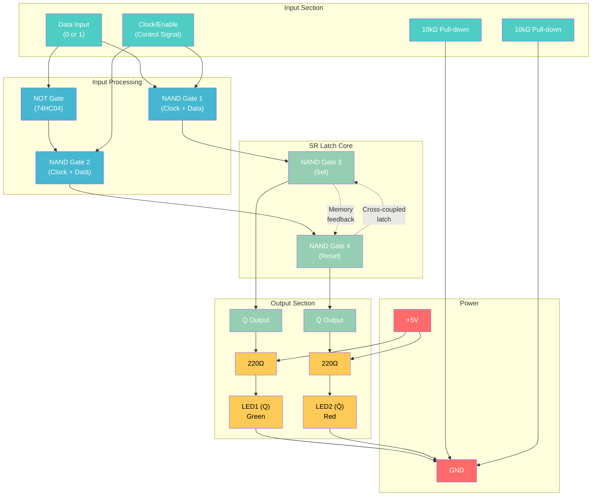
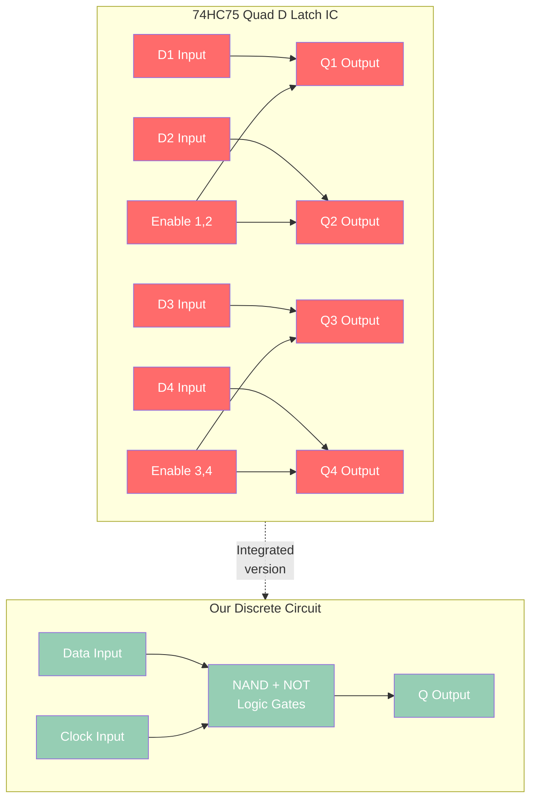
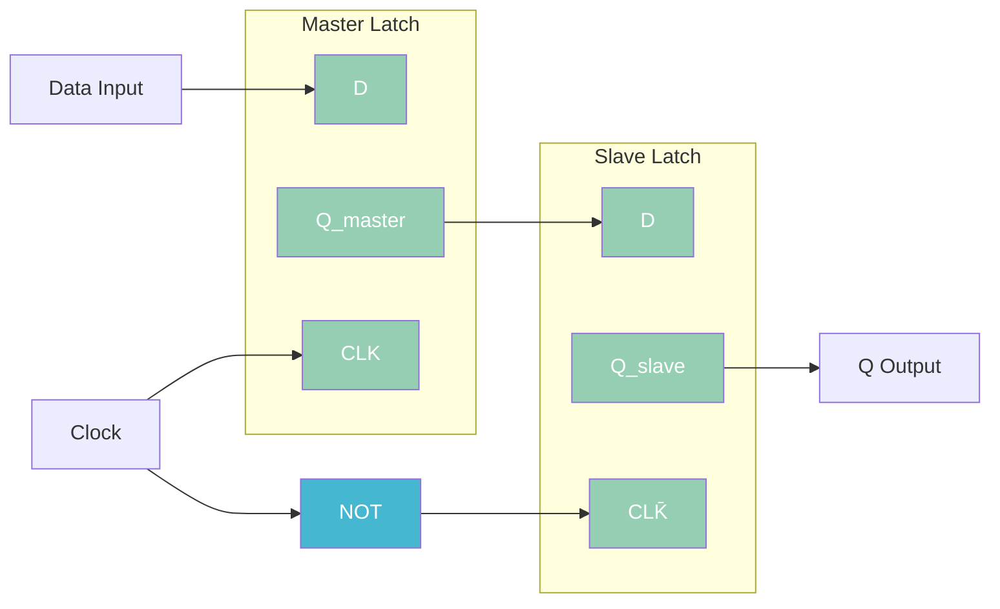

# D Latch with Clock Tutorial - Eliminating Invalid States

A comprehensive guide to building and understanding D (Data) latches - the solution to SR latch limitations with controlled timing.

## Why D Latches?

D latches solve the fundamental problems of SR latches:
- **Eliminates invalid state**: Only one data input prevents conflicting commands
- **Controlled timing**: Clock/Enable input determines when data is accepted
- **Simpler interface**: Single data input instead of separate Set/Reset
- **Foundation for flip-flops**: Building block for edge-triggered memory

## D Latch Circuit Implementation

### Method 1: NAND-Based D Latch

### Components Required

| Component | Quantity | Source | Part Number | Price |
|-----------|----------|--------|-------------|-------|
| 74HC00 (Quad NAND) | 1 | Rapid Electronics | SN74HC00N | £0.32 |
| 74HC04 (Hex NOT) | 1 | Rapid Electronics | SN74HC04N | £0.35 |
| Push Buttons | 2 | ELEGOO Kit | Data + Clock | Included |
| Toggle Switch | 1 | Silicon Ark | MS244 (Clock) | £1.50 |
| LEDs (Green/Red) | 2 | ELEGOO Kit | Output indicators | Included |
| 220Ω Resistors | 2 | ELEGOO Kit | Current limiting | Included |
| 10kΩ Resistors | 2 | ELEGOO Kit | Pull-down | Included |
| Breadboard | 1 | ELEGOO Kit | 830-point | Included |

**Total additional cost: £2.17**

## Truth Table and Operation

### D Latch Behavior

| Clock (CLK) | Data (D) | Q (next) | Q̄ (next) | Action |
|-------------|----------|----------|-----------|---------|
| 0 | X | Q (prev) | Q̄ (prev) | **Hold** - Clock disabled |
| 1 | 0 | 0 | 1 | **Store 0** - Reset state |
| 1 | 1 | 1 | 0 | **Store 1** - Set state |

### Key Insight: Transparent Operation

When **Clock = 1**: D latch is "transparent" - output follows input
When **Clock = 0**: D latch "holds" - output maintains previous state

## Timing Diagram

**Timing Relationships:**
- **Setup time**: Data must be stable before clock goes HIGH
- **Hold time**: Data must remain stable after clock goes LOW
- **Propagation delay**: Time from clock edge to output change
- **Transparency**: Output changes while clock is HIGH

## Build Instructions

### Step 1: IC Placement and Power
1. Insert 74HC00 (NAND gates) into breadboard
2. Insert 74HC04 (NOT gates) into breadboard  
3. Connect Pin 14 of both ICs to +5V
4. Connect Pin 7 of both ICs to GND

### Step 2: Input Logic (Data Processing)
1. **Data inverter**: Connect Data input to 74HC04 input (Pin 1)
2. **NAND1**: Connect Data and Clock to 74HC00 inputs (Pins 1,2)
3. **NAND2**: Connect inverted Data and Clock to 74HC00 inputs (Pins 4,5)

### Step 3: SR Latch Core
1. **NAND3 (Set)**: Input from NAND1 output, cross-coupled to NAND4
2. **NAND4 (Reset)**: Input from NAND2 output, cross-coupled to NAND3
3. **Cross-coupling**: NAND3 output → NAND4 input, NAND4 output → NAND3 input

### Step 4: Outputs and Indicators
1. Connect Q output to Green LED via 220Ω resistor
2. Connect Q̄ output to Red LED via 220Ω resistor
3. Connect LED cathodes to GND

### Step 5: Input Controls
1. **Data button**: Via 10kΩ pull-down resistor
2. **Clock toggle switch**: For manual clock control
3. Alternative: Clock button for edge testing

## Experimental Procedures

### Experiment 1: Transparent Operation

**Setup**: Clock toggle switch in HIGH position

| Step | Data Button | Expected Result |
|------|-------------|-----------------|
| 1 | Press (D=1) | Green LED ON immediately |
| 2 | Release (D=0) | Red LED ON immediately |
| 3 | Press again | Green LED ON immediately |

**Observation**: Output follows input when clock is enabled

### Experiment 2: Hold Operation

**Setup**: Set Data=1, Clock=HIGH, then Clock=LOW

| Step | Action | Clock | Data | Q State |
|------|--------|-------|------|---------|
| 1 | Set initial | HIGH | 1 | 1 (Green ON) |
| 2 | Disable clock | LOW | 1 | 1 (Held) |
| 3 | Change data | LOW | 0 | 1 (Still held!) |
| 4 | Change data | LOW | 1 | 1 (Still held!) |
| 5 | Enable clock | HIGH | 1 | 1 (Follows input) |

**Observation**: Data changes ignored when clock is disabled

### Experiment 3: Clock Edge Response

**Setup**: Use push button for clock (momentary enable)

1. Set Data=0
2. Press and release Clock button
3. Observe Q=0 is latched
4. Change Data=1 (clock still LOW)
5. Press and release Clock button again
6. Observe Q=1 is now latched

## Advanced: 74HC75 Comparison

The 74HC75 IC we discussed earlier contains 4 D latches with enable inputs:

**Comparison:**
- **Discrete version**: Educational, customizable, visible logic
- **IC version**: Compact, professional, multiple latches
- **Both implement**: Same D latch functionality

## Applications and Use Cases

### Memory Elements
- **Registers**: Multiple D latches store multi-bit values
- **Data buffers**: Hold data while other operations complete
- **State machines**: Remember current state in sequential circuits

### Interface Circuits  
- **Address latches**: Hold memory addresses during bus cycles
- **Data capture**: Sample input signals at specific times
- **Synchronization**: Align data with clock domains

### Control Logic
- **Enable signals**: Gate data flow in digital systems
- **Status registers**: Capture and hold system flags
- **Command latches**: Store control commands until executed

## From D Latch to D Flip-Flop

The D latch is "level-triggered" (transparent when clock=HIGH). D flip-flops are "edge-triggered" (change only on clock transitions):

**Master-Slave Configuration:**
- **Clock HIGH**: Master latch transparent, slave holds
- **Clock LOW**: Master holds, slave transparent  
- **Result**: Output changes only on falling edge

## Troubleshooting

### Common Issues

**Output doesn't change**: 
- Check clock enable signal
- Verify cross-coupling in SR latch core
- Confirm power connections to all ICs

**Random behavior**:
- Add 0.1µF decoupling capacitors near each IC
- Check for loose breadboard connections
- Verify pull-down resistors on inputs

**Always transparent**:
- Clock input might be stuck HIGH
- Check toggle switch connections
- Verify clock signal reaches input logic

**Won't hold state**:
- SR latch core cross-coupling broken
- Check NAND gate connections
- Verify feedback paths

## Learning Outcomes

After completing this tutorial:
- **Understand controlled memory**: Clock-gated data storage
- **Transparent vs holding**: Level-triggered operation
- **Timing relationships**: Setup, hold, propagation delays
- **Invalid state elimination**: How single input prevents conflicts
- **Foundation knowledge**: Basis for flip-flops and registers

## Next Steps

1. **Build D flip-flop**: Master-slave configuration for edge triggering
2. **Create register**: Multiple D latches for multi-bit storage
3. **Add three-state outputs**: For bus-oriented systems
4. **Study commercial ICs**: Compare with 74HC373/74HC374 latches
5. **Design counters**: Sequential circuits using clocked memory

---

*This tutorial bridges the gap between basic SR latches and sophisticated clocked memory systems used throughout digital electronics.*
