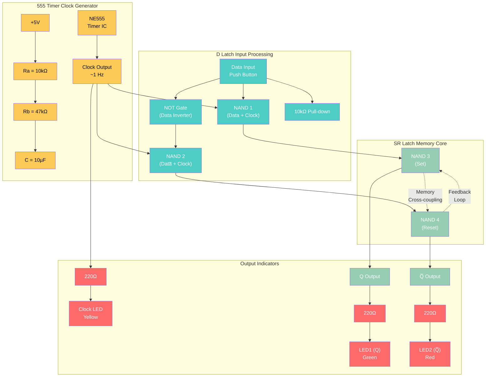
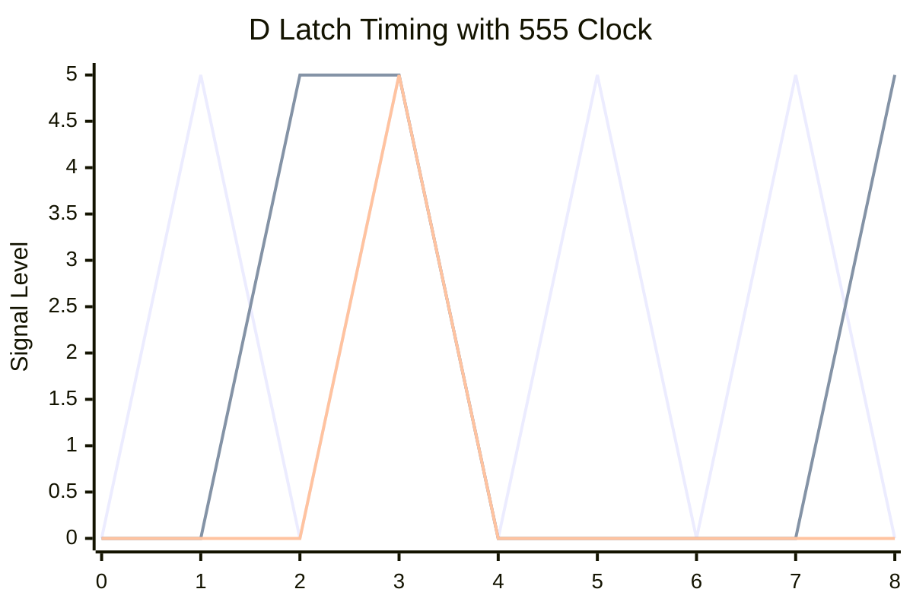
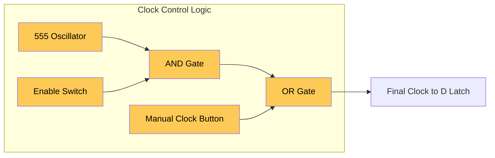

# D Latch with 555 Timer Clock - Automatic Timing Control

A comprehensive guide to building D latches with real oscillating clock signals using the 555 timer IC for automatic operation.

## Why Use a Real Clock?

Moving from manual switches to automatic timing demonstrates:
- **Real-world operation**: How digital systems actually work
- **Timing relationships**: Setup/hold times become critical
- **Dynamic behavior**: Continuous operation vs step-by-step
- **Foundation for computers**: Basis of all synchronous digital systems

## Complete Circuit with 555 Timer Clock

### System Overview



### 555 Timer Clock Configuration

**Astable Mode Configuration:**
```
    VCC (+5V)
      │
    ┌─┴─ Pin 8 (VCC)
    │ ┌─ Pin 4 (Reset) ── VCC
    │ │ ┌─ Pin 7 (Discharge)
    │ │ │   │
   ┌┴─┴─┴─┐ │
   │ 555  │ │
   │Timer │ │
   └┬─┬─┬─┘ │
    │ │ │   │
    │ │ └─ Pin 6 (Threshold) ─┬─ Ra ── VCC
    │ │                      │
    │ └─ Pin 2 (Trigger) ────┼─ Rb ── Pin 7
    │                        │
    └─ Pin 3 (Output) ───────┼─ C ─── GND
                             │
                           Clock Output
```

**Timing Calculation:**
- **Frequency**: f = 1.44 / ((Ra + 2×Rb) × C)
- **High Time**: t_high = 0.693 × (Ra + Rb) × C  
- **Low Time**: t_low = 0.693 × Rb × C
- **With Ra=10kΩ, Rb=47kΩ, C=10µF**: f ≈ 1.4 Hz

## Components Required

| Component | Quantity | Source | Part Number | Price |
|-----------|----------|--------|-------------|-------|
| **Clock Generation** | | | | |
| NE555 Timer IC | 1 | ELEGOO Kit | NE555P | Included |
| 10kΩ Resistor (Ra) | 1 | ELEGOO Kit | Timing | Included |
| 47kΩ Resistor (Rb) | 1 | ELEGOO Kit | Timing | Included |
| 10µF Capacitor | 1 | ELEGOO Kit | Electrolytic | Included |
| **Logic Gates** | | | | |
| 74HC00 (Quad NAND) | 1 | Rapid Electronics | SN74HC00N | £0.32 |
| 74HC04 (Hex NOT) | 1 | Rapid Electronics | SN74HC04N | £0.35 |
| **Interface** | | | | |
| Push Button (Data) | 1 | ELEGOO Kit | Tactile switch | Included |
| LEDs (Green/Red/Yellow) | 3 | ELEGOO Kit | Status indicators | Included |
| 220Ω Resistors | 3 | ELEGOO Kit | Current limiting | Included |
| 10kΩ Resistor | 1 | ELEGOO Kit | Pull-down | Included |
| Breadboard | 1 | ELEGOO Kit | 830-point | Included |

**Total additional cost: £0.67**

## Build Instructions

### Step 1: 555 Timer Clock Generator

**IC Placement and Power:**
1. Insert NE555 into breadboard
2. Connect Pin 8 to +5V rail
3. Connect Pin 1 to GND rail
4. Connect Pin 4 (Reset) to +5V (always enabled)

**Timing Components:**
1. **Ra (10kΩ)**: Connect +5V to Pin 7 via Ra
2. **Rb (47kΩ)**: Connect Pin 7 to Pin 6 via Rb  
3. **C (10µF)**: Connect Pin 6 to GND via C
4. **Trigger**: Connect Pin 6 to Pin 2 (self-triggering)
5. **Output**: Pin 3 provides clock signal

### Step 2: D Latch Logic

**Gate Placement:**
1. Insert 74HC00 (NAND gates) into breadboard
2. Insert 74HC04 (NOT gates) into breadboard
3. Power both ICs: Pin 14 to +5V, Pin 7 to GND

**Input Processing:**
1. **Data inverter**: Connect Data button to 74HC04 Pin 1
2. **NAND1**: Connect Data and Clock to 74HC00 Pins 1,2  
3. **NAND2**: Connect inverted Data and Clock to 74HC00 Pins 4,5

**SR Latch Core:**
1. **NAND3**: Input from NAND1, output to NAND4 input
2. **NAND4**: Input from NAND2, output to NAND3 input
3. **Cross-coupling**: Creates memory feedback loop

### Step 3: Clock Distribution and Indicators

**Clock Signal Routing:**
1. Connect 555 output (Pin 3) to NAND1 input
2. Connect 555 output (Pin 3) to NAND2 input
3. Connect 555 output to Yellow LED via 220Ω resistor (clock indicator)

**Output LEDs:**
1. **Green LED**: Q output via 220Ω resistor
2. **Red LED**: Q̅ output via 220Ω resistor  
3. **Yellow LED**: Clock signal via 220Ω resistor

## Operation and Timing

### Timing Diagram



**Signal Descriptions:**
- **Top**: Clock signal from 555 timer (~1.4 Hz)
- **Middle**: Data input (controlled by push button)
- **Bottom**: Q output (follows data when clock HIGH)

### Dynamic Operation

**Transparent Phase (Clock HIGH):**
- **Duration**: ~0.5 seconds 
- **Behavior**: Q output follows D input
- **LED behavior**: Green/Red LEDs track data button
- **Yellow LED**: ON (indicating clock HIGH)

**Hold Phase (Clock LOW):**
- **Duration**: ~0.2 seconds
- **Behavior**: Q output holds previous value
- **LED behavior**: Green/Red LEDs frozen  
- **Yellow LED**: OFF (indicating clock LOW)

## Experimental Procedures

### Experiment 1: Automatic Transparent Operation

**Setup**: Power on circuit, observe automatic cycling

**Observations:**
1. **Yellow LED blinks** at ~1.4 Hz (clock signal)
2. **During clock HIGH**: Press/release data button → immediate LED response
3. **During clock LOW**: Press/release data button → no LED change
4. **State persistence**: Data held during clock LOW phases

**Timing**: You have ~0.5 seconds during each clock HIGH phase to change data

### Experiment 2: Data Capture Timing

**Procedure:**
1. Wait for clock to go LOW (Yellow LED OFF)
2. Set desired data state (press button for '1', release for '0')  
3. Wait for clock to go HIGH (Yellow LED ON)
4. Observe data captured and displayed on Green/Red LEDs
5. Change data while clock still HIGH → immediate response
6. Wait for clock to go LOW → data frozen until next cycle

### Experiment 3: Setup and Hold Time Testing

**Critical Timing Windows:**

**Setup Time Test:**
1. Wait for clock rising edge approach
2. Change data just before clock goes HIGH
3. Observe if data is captured correctly
4. **Result**: Demonstrates setup time requirements

**Hold Time Test:**  
1. Change data just as clock goes LOW
2. Observe if previous data was held correctly
3. **Result**: Demonstrates hold time requirements

### Experiment 4: Frequency Adjustment

**Modify timing for different speeds:**

**Slower Clock (0.5 Hz)**: Replace Rb with 100kΩ
- Longer observation time
- Easier to see state changes
- Better for learning

**Faster Clock (5 Hz)**: Replace Rb with 10kΩ  
- More realistic timing
- Harder to control manually
- Demonstrates real-world speeds

## Advanced Features

### Adding Clock Control



**Enhanced Control Options:**
- **Auto/Manual switch**: Choose between 555 clock or manual button
- **Clock enable**: Disable automatic clock when needed
- **Single-step**: Manual button for step-by-step operation
- **Frequency control**: Potentiometer to adjust 555 timing

### Multiple D Latches (Register)

**4-Bit Register Implementation:**
- 4× D latch circuits sharing common clock
- 4× Data inputs for parallel data entry
- 4× LED outputs showing stored 4-bit value
- Demonstrates how computer registers work

## Troubleshooting

### 555 Timer Issues

**No clock output:**
- Check power connections (Pin 8 = +5V, Pin 1 = GND)
- Verify Pin 4 connected to +5V (reset disabled)
- Check timing components (Ra, Rb, C) connections

**Wrong frequency:**
- Measure actual resistor values (tolerance affects timing)
- Check capacitor polarity (electrolytic must be correct)
- Verify Pin 6 to Pin 2 connection (trigger)

**Irregular timing:**
- Add 0.01µF ceramic capacitor from Pin 5 to GND (bypass)
- Check breadboard connections for intermittent contacts
- Ensure clean +5V power supply

### D Latch Issues

**Won't follow data during clock HIGH:**
- Verify clock signal reaches both NAND gates
- Check data inverter (74HC04) operation
- Confirm cross-coupling in SR latch core

**Won't hold data during clock LOW:**
- Check SR latch feedback connections
- Verify NAND gate power connections
- Test each NAND gate individually

**Erratic behavior:**
- Add decoupling capacitors (0.1µF) near each IC
- Check all ground connections
- Verify power supply can handle current load

## Timing Specifications

### 555 Timer Characteristics
- **Supply voltage**: 4.5V to 15V (5V typical)
- **Output current**: Up to 200mA (drives multiple inputs)
- **Frequency range**: 0.01 Hz to 100 kHz (with proper components)
- **Temperature stability**: ±50 ppm/°C

### 74HC Logic Timing
- **Propagation delay**: ~10ns (74HC family)
- **Setup time**: ~5ns (data before clock)
- **Hold time**: ~2ns (data after clock)
- **Maximum frequency**: >50 MHz

### System Timing Analysis
With 1.4 Hz clock:
- **Clock period**: 714ms
- **HIGH time**: ~500ms (transparent)
- **LOW time**: ~214ms (hold)
- **Human reaction time**: ~200ms (adequate for manual control)

## Learning Outcomes

After completing this tutorial:
- **Real clock operation**: Understanding continuous timing
- **Setup/hold times**: Critical timing relationships
- **Dynamic behavior**: Moving beyond static analysis
- **System integration**: Combining multiple functional blocks
- **Practical constraints**: Real-world timing limitations

## Next Steps

1. **Edge-triggered flip-flops**: Master-slave configurations
2. **Synchronous counters**: Chained clocked memory elements
3. **Microprocessor basics**: Clock domains and timing
4. **FPGA development**: Hardware description languages
5. **PCB design**: Layout considerations for high-speed clocks

---

*This tutorial demonstrates real-world clocked memory operation, bridging the gap between educational circuits and practical digital systems.*****
