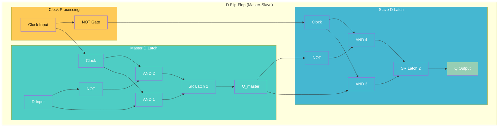
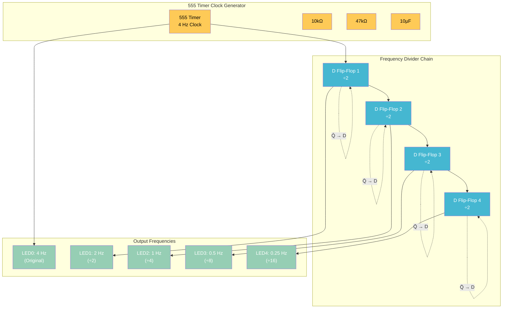

# D Flip-Flop Frequency Divider Project

A practical demonstration of edge-triggered D flip-flops built from fundamental logic gates, creating a binary frequency divider chain.

## Project Goal

Build a 4-stage binary frequency divider that takes a 555 timer clock input and creates four different frequencies: f/2, f/4, f/8, and f/16, where f is the input frequency.

## Why This Project Matters

**Demonstrates key concepts:**
- Edge-triggered vs level-triggered behavior
- Binary counting principles
- Clock domain relationships
- Foundation of computer timing systems

**Real-world applications:**
- CPU clock generation (base clock → CPU, bus, peripheral clocks)
- Digital watch circuits (32.768kHz crystal → 1 Hz seconds)
- PWM generation for motor control
- Baud rate generation for serial communication

## D Flip-Flop Implementation

### Master-Slave Configuration



### Operation Principle

**Clock HIGH Phase:**
- Master latch transparent (follows D input)
- Slave latch holds previous value
- Data propagates to Q_master but not to output

**Clock LOW Phase:**
- Master latch holds (freezes current D value)
- Slave latch transparent (Q_master → Q output)
- Output changes during LOW phase

**Result:** Output changes only on falling edge of clock

## Complete Frequency Divider Circuit

### System Overview



### Key Connection: Q̄ → D Feedback

Each flip-flop has its **inverted output (Q̄) connected to its data input (D)**:
- When Q=0, D=1 → next clock edge sets Q=1
- When Q=1, D=0 → next clock edge sets Q=0
- **Result:** Output toggles on every clock edge = frequency division by 2

## Build Instructions

### Components Required

| Component | Quantity | Usage | Source |
|-----------|----------|-------|--------|
| 74HC00 (NAND) | 4 | D flip-flop logic | Your collection |
| 74HC04 (NOT) | 2 | Clock inversion, Q̄ generation | Your collection |
| NE555 Timer | 1 | Clock source | ELEGOO kit |
| LEDs | 5 | Frequency visualization | ELEGOO kit |
| 220Ω Resistors | 5 | LED current limiting | ELEGOO kit |
| 10kΩ, 47kΩ, 10µF | 1 each | 555 timing | ELEGOO kit |

### Step 1: Build One D Flip-Flop

**Master D Latch:**
1. Use 2 NAND gates from 74HC00 for SR latch core
2. Use 2 NAND gates for input AND logic
3. Use 1 NOT gate from 74HC04 for data inversion

**Slave D Latch:**
1. Use 2 NAND gates from second 74HC00 for SR latch core  
2. Use 2 NAND gates for input AND logic
3. Use 1 NOT gate for data inversion

**Clock Distribution:**
1. Master gets direct clock signal
2. Slave gets inverted clock signal (from 74HC04)

### Step 2: Test Single Flip-Flop

**Verify edge-triggered behavior:**
1. Connect D input to toggle switch
2. Connect clock to manual button
3. Observe output changes only on button release (falling edge)

### Step 3: Build Frequency Divider

**Connect Q̄ to D for each flip-flop:**
1. Use spare NOT gate to generate Q̄ from Q
2. Connect Q̄ output to D input of same flip-flop
3. Connect Q output to input clock of next flip-flop

### Step 4: Add Visual Indicators

**LED connections:**
1. Connect each frequency output to LED via 220Ω resistor
2. Include original clock signal LED for reference
3. Arrange LEDs in sequence for visual pattern

## Expected Behavior

### Timing Relationships

**555 Timer at 4 Hz:**
- LED0 (original): Blinks 4 times per second
- LED1 (÷2): Blinks 2 times per second  
- LED2 (÷4): Blinks 1 time per second
- LED3 (÷8): Blinks every 2 seconds
- LED4 (÷16): Blinks every 4 seconds

### Visual Pattern

**Binary counting sequence:** Each LED represents a bit position
- LED1 = LSB (changes most frequently)
- LED4 = MSB (changes least frequently)
- **Pattern creates binary counter display**

**Example sequence over 16 clock cycles:**
```
Clock | LED4 | LED3 | LED2 | LED1 | Binary
------|------|------|------|------|-------
  0   |  0   |  0   |  0   |  0   | 0000
  1   |  0   |  0   |  0   |  1   | 0001
  2   |  0   |  0   |  1   |  0   | 0010
  3   |  0   |  0   |  1   |  1   | 0011
  4   |  0   |  1   |  0   |  0   | 0100
...   | ...  | ...  | ...  | ...  | ...
 15   |  1   |  1   |  1   |  1   | 1111
 16   |  0   |  0   |  0   |  0   | 0000 (repeats)
```

## Measurements and Analysis

### Timing Verification

**With oscilloscope or logic analyzer:**
1. Measure input clock frequency
2. Verify each output is exactly half the previous frequency
3. Check phase relationships between stages
4. Confirm edge-triggered behavior (changes on falling edge)

**Manual timing check:**
1. Count LED blinks over 60 seconds
2. Verify mathematical relationships
3. Document any timing drift

### Troubleshooting

**Common issues:**
- **No division**: Check Q̄ to D feedback connections
- **Wrong frequency**: Verify clock signal integrity
- **Multiple transitions**: Check for switch bounce on manual clock
- **Missing stages**: Test each flip-flop independently

## Extensions and Improvements

### Advanced Features

**Reset functionality:**
- Add master reset to all flip-flops
- Allows synchronous restart of counting sequence

**Enable control:**
- Add enable inputs to gate clock signals
- Allows stopping/starting frequency division

**Different division ratios:**
- Modify feedback connections for ÷3, ÷5, ÷10 dividers
- Requires additional logic gates and state control

### Real-World Applications

**Clock tree generation:**
- CPU systems use similar circuits for multiple clock domains
- Different peripherals need different clock speeds

**Timing reference:**
- Digital watches divide 32.768 kHz crystal to 1 Hz
- Same principle as your circuit but different frequencies

**PWM generation:**
- Variable frequency outputs for motor speed control
- Audio frequency synthesis

## Learning Outcomes

**Conceptual understanding:**
- Edge-triggered vs level-triggered memory
- Binary counting and frequency relationships
- Clock domain concepts in digital systems

**Practical skills:**
- Building complex circuits from simple components
- Systematic testing and troubleshooting
- Understanding timing relationships

**Foundation knowledge:**
- How computer clocks work internally
- Basis for understanding CPU timing
- Preparation for microarchitecture concepts

This project bridges the gap between basic flip-flop understanding and practical digital system design, demonstrating concepts fundamental to microprocessor timing and IoT device operation.
