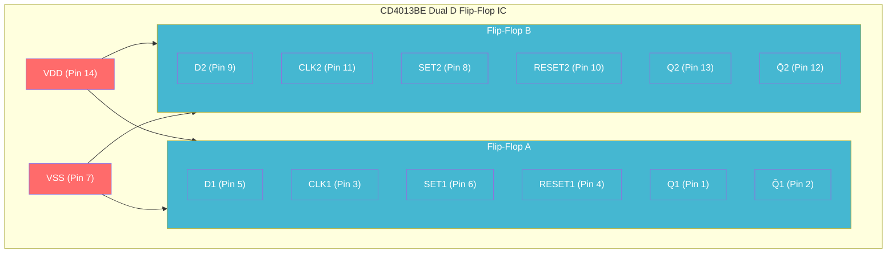
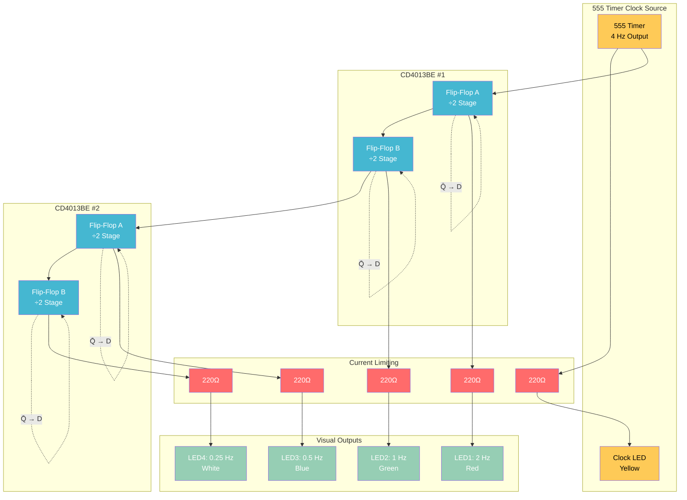

# Frequency Divider with CD4013BE IC Flip-Flops

Building the same 4-stage binary frequency divider using integrated D flip-flop components instead of discrete gates.

## Comparison: Discrete vs Integrated

**Discrete approach (previous tutorial):**
- 16+ individual logic gates
- Complex wiring and connections
- Educational but time-intensive
- Shows internal flip-flop operation

**IC approach (this tutorial):**
- 2 dual flip-flop ICs (4 flip-flops total)
- Simple, clean connections
- Focus on system behavior
- Industry-standard implementation

## CD4013BE Dual D Flip-Flop

### IC Overview



### Pin Configuration

```
CD4013BE Pinout:
 1 - Q1        14 - VDD (+5V)
 2 - Q̄1        13 - Q2
 3 - CLK1      12 - Q̄2
 4 - RESET1    11 - CLK2
 5 - D1        10 - RESET2
 6 - SET1       9 - D2
 7 - VSS (GND)  8 - SET2
```

**Key Features:**
- **Positive edge-triggered**: Changes on clock rising edge
- **Individual SET/RESET**: Asynchronous control inputs
- **Complementary outputs**: Both Q and Q̄ available
- **CMOS technology**: Low power, wide voltage range (3V-15V)

## Complete 4-Stage Frequency Divider

### Circuit Diagram



## Build Instructions

### Components Required

| Component | Quantity | Source | Usage |
|-----------|----------|--------|-------|
| CD4013BE | 2 | Your Silicon Ark order | 4 D flip-flops |
| NE555 Timer | 1 | ELEGOO kit | Clock source |
| LEDs (assorted colors) | 5 | ELEGOO kit | Frequency display |
| 220Ω Resistors | 5 | ELEGOO kit | Current limiting |
| 10kΩ, 47kΩ Resistors | 1 each | ELEGOO kit | 555 timing |
| 10µF Capacitor | 1 | ELEGOO kit | 555 timing |
| Breadboard | 1 | ELEGOO kit | Assembly |

### Step 1: Power and Clock Setup

**555 Timer Configuration:**
1. Wire 555 in astable mode for 4 Hz output
2. Ra = 10kΩ, Rb = 47kΩ, C = 10µF
3. Connect Pin 3 (output) to clock distribution point

**IC Power Connections:**
1. Connect Pin 14 of both CD4013BE ICs to +5V
2. Connect Pin 7 of both ICs to GND
3. Add 0.1µF decoupling capacitors near each IC

### Step 2: Flip-Flop Configuration

**For each flip-flop (4 total):**

**Control inputs (inactive):**
1. Connect SET pins (6, 8) to GND (inactive)
2. Connect RESET pins (4, 10) to GND (inactive)

**Feedback connections (key to frequency division):**
1. **FF1**: Connect Q̄1 (Pin 2) to D1 (Pin 5)
2. **FF2**: Connect Q̄2 (Pin 12) to D2 (Pin 9)
3. **FF3**: Connect Q̄1 (Pin 2) to D1 (Pin 5) on second IC
4. **FF4**: Connect Q̄2 (Pin 12) to D2 (Pin 9) on second IC

### Step 3: Clock Chain Connections

**Clock signal routing:**
1. **555 output** → **CLK1** (Pin 3, first IC)
2. **Q1** (Pin 1, first IC) → **CLK2** (Pin 11, first IC)
3. **Q2** (Pin 13, first IC) → **CLK1** (Pin 3, second IC)
4. **Q1** (Pin 1, second IC) → **CLK2** (Pin 11, second IC)

### Step 4: Output Indicators

**LED connections:**
1. **Clock LED**: 555 output → 220Ω → Yellow LED → GND
2. **Stage 1**: Q1 (Pin 1, IC1) → 220Ω → Red LED → GND
3. **Stage 2**: Q2 (Pin 13, IC1) → 220Ω → Green LED → GND
4. **Stage 3**: Q1 (Pin 1, IC2) → 220Ω → Blue LED → GND
5. **Stage 4**: Q2 (Pin 13, IC2) → 220Ω → White LED → GND

## Detailed Wiring Table

| Connection | From | To | Purpose |
|------------|------|----|---------| 
| Clock Input | 555 Pin 3 | IC1 Pin 3 | Master clock |
| Stage 1→2 | IC1 Pin 1 | IC1 Pin 11 | Q1 → CLK2 |
| Stage 2→3 | IC1 Pin 13 | IC2 Pin 3 | Q2 → CLK1 |
| Stage 3→4 | IC2 Pin 1 | IC2 Pin 11 | Q1 → CLK2 |
| FB Stage 1 | IC1 Pin 2 | IC1 Pin 5 | Q̄1 → D1 |
| FB Stage 2 | IC1 Pin 12 | IC1 Pin 9 | Q̄2 → D2 |
| FB Stage 3 | IC2 Pin 2 | IC2 Pin 5 | Q̄1 → D1 |
| FB Stage 4 | IC2 Pin 12 | IC2 Pin 9 | Q̄2 → D2 |

## Operation Analysis

### Timing Behavior

**Edge-triggered operation:**
- CD4013BE changes state on **positive clock edge** (rising edge)
- Much more predictable than level-triggered latches
- Eliminates race conditions and timing hazards

**Frequency division mechanism:**
1. Each flip-flop toggles its output on every clock edge
2. Q̄ → D feedback ensures toggle behavior
3. Output frequency = Input frequency ÷ 2

### Expected Results

**With 4 Hz input clock:**
- **Yellow LED**: 4 Hz (original clock)
- **Red LED**: 2 Hz (÷2)
- **Green LED**: 1 Hz (÷4)
- **Blue LED**: 0.5 Hz (÷8)
- **White LED**: 0.25 Hz (÷16)

**Visual pattern:** Creates a binary counting sequence in LED illumination

## Advantages of IC Implementation

### Simplified Construction

**Reduced complexity:**
- 8 IC pins vs 50+ discrete connections
- Fewer breadboard wiring errors
- Faster assembly and testing

**Improved reliability:**
- Factory-tested flip-flop behavior
- Matched propagation delays
- Better noise immunity

**Professional approach:**
- Industry-standard implementation
- Easier to scale and modify
- Standard pinouts and specifications

### Performance Benefits

**Timing characteristics:**
- Guaranteed setup and hold times
- Specified propagation delays
- Temperature and voltage stability

**Power efficiency:**
- CMOS technology (low static power)
- Wide supply voltage range (3V-15V)
- Suitable for battery-powered applications

## Testing and Verification

### Functional Testing

**Visual verification:**
1. Power up circuit and observe LED patterns
2. Count blinks over 60 seconds to verify frequencies
3. Check binary counting sequence

**Signal measurements:**
1. Use oscilloscope to measure actual frequencies
2. Verify edge-triggered behavior
3. Check signal integrity and timing

### Troubleshooting

**Common issues:**
- **No oscillation**: Check SET/RESET pins are grounded
- **Wrong frequencies**: Verify Q̄ → D feedback connections
- **Erratic behavior**: Check power connections and decoupling
- **Multiple triggers**: Ensure clean clock signal from 555

**Debugging approach:**
1. Test 555 timer output first
2. Verify each flip-flop stage independently
3. Check feedback connections with multimeter
4. Use logic probe or oscilloscope for dynamic testing

## Comparison with Discrete Version

| Aspect | Discrete Gates | IC Flip-Flops |
|--------|----------------|---------------|
| **Component Count** | 16+ gates | 2 ICs |
| **Wiring Complexity** | Very High | Low |
| **Build Time** | 2-3 hours | 30 minutes |
| **Educational Value** | High (internal operation) | Medium (system level) |
| **Reliability** | Lower (many connections) | Higher (integrated) |
| **Industry Relevance** | Academic | Professional |
| **Modification** | Difficult | Easy |
| **Troubleshooting** | Complex | Straightforward |

## Real-World Applications

### Digital System Design

**Computer architectures:**
- CPU clock distribution trees
- Bus timing generation
- Peripheral clock synthesis

**Embedded systems:**
- Microcontroller timing circuits
- Real-time clock generation
- Power management frequency scaling

### IoT Device Implementation

**Sensor timing:**
- ADC sampling rate control
- Communication baud rate generation
- Periodic wake-up signals

**Power optimization:**
- Dynamic frequency scaling
- Sleep mode timing
- Battery life extension

## Extensions and Improvements

### Advanced Features

**Reset functionality:**
- Connect master reset to all RESET pins
- Allows synchronous restart of counting sequence
- Essential for system initialization

**Enable control:**
- Add clock gating logic
- Allows stopping/starting frequency division
- Power saving when not needed

**Variable division ratios:**
- Use additional logic for non-binary division
- Implement ÷3, ÷5, ÷10 counters
- More flexible timing generation

### System Integration

**Multiple clock domains:**
- Generate several different frequencies simultaneously
- Each domain for different system functions
- Demonstrates real microprocessor clock architecture

**Synchronization circuits:**
- Add phase-locked loop (PLL) for frequency synthesis
- Crystal oscillator for precision timing
- Professional clock generation techniques

## Learning Outcomes

### Technical Skills

**Digital system design:**
- Understanding commercial IC usage
- Professional circuit construction techniques
- Industry-standard approaches

**Timing analysis:**
- Clock domain relationships
- Frequency planning and distribution
- Performance optimization considerations

### Conceptual Understanding

**Edge-triggered vs level-triggered:**
- Why edge triggering is preferred in synchronous systems
- Elimination of timing hazards and race conditions
- Foundation for understanding CPU timing

**System architecture:**
- How complex digital systems manage multiple clock speeds
- Relationship between clock frequency and system performance
- Power vs performance trade-offs

This IC-based implementation demonstrates how the same concepts scale from educational discrete circuits to professional digital system design, directly applicable to both microarchitecture and IoT device development.
