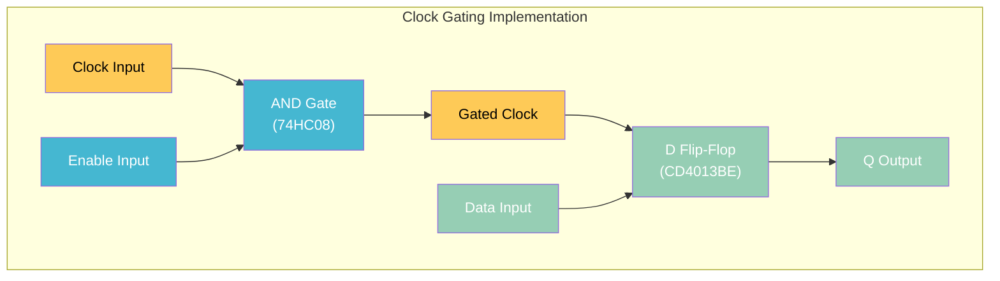
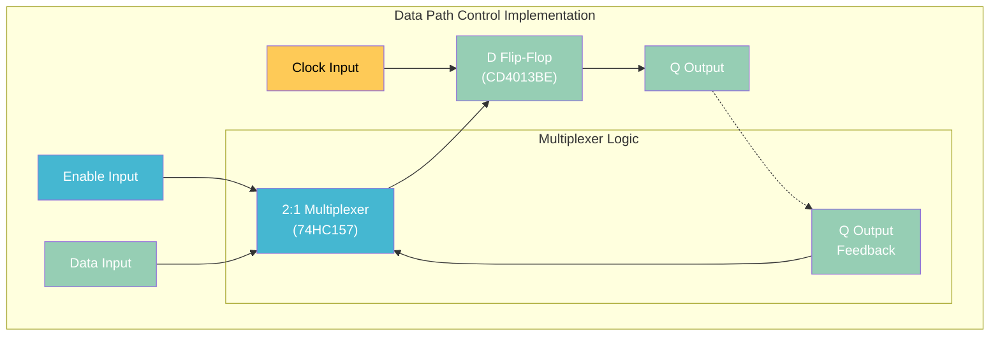
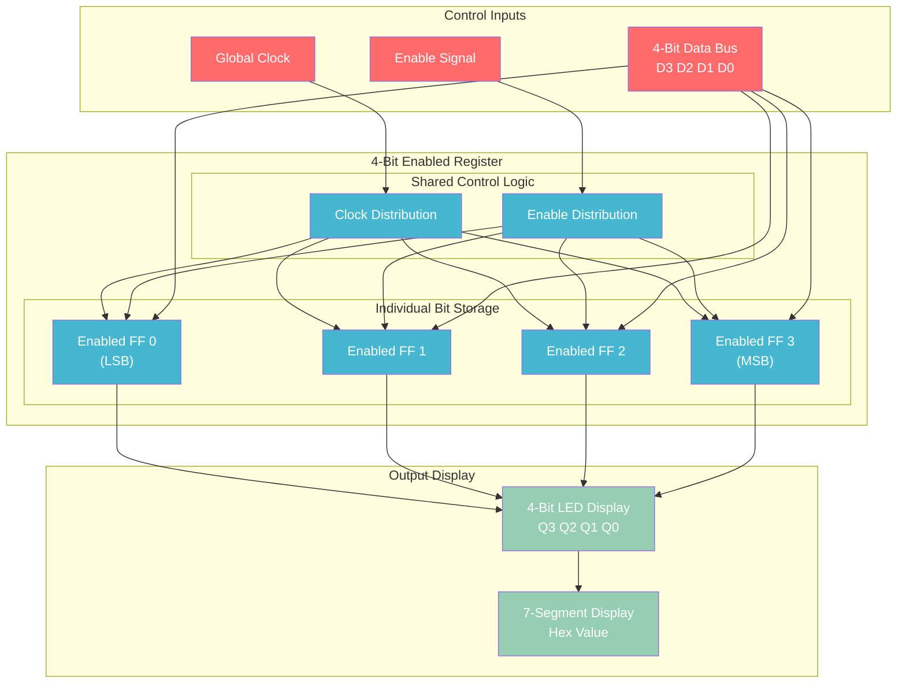
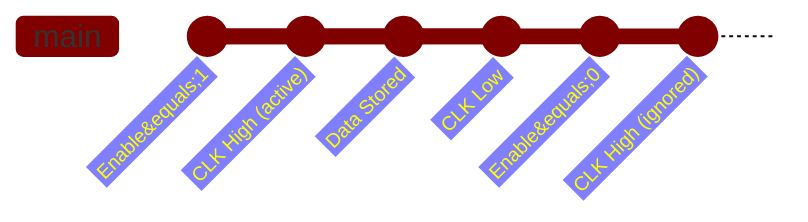

# Enabled D Flip-Flop Tutorial - Conditional Memory Storage

Building D flip-flops with enable inputs for selective data storage - fundamental to register files and memory control systems.

## Why Enabled Flip-Flops Matter

**Problem with basic flip-flops:**
- Change state on every clock edge
- No way to prevent unwanted updates
- All connected flip-flops update simultaneously

**Enable input solves:**
- **Selective updating**: Only enabled flip-flops change state
- **Register file control**: Update specific registers while preserving others
- **Pipeline control**: Halt stages without losing data
- **Power savings**: Disable unused memory elements

## Enabled Flip-Flop Concept

### Truth Table

| Clock | Enable | D | Q(next) | Action |
|-------|--------|---|---------|--------|
| ↑ | 0 | X | Q(prev) | **Hold** - Ignore clock edge |
| ↑ | 1 | 0 | 0 | **Update** - Store 0 |
| ↑ | 1 | 1 | 1 | **Update** - Store 1 |
| Other | X | X | Q(prev) | **Hold** - No change |

### Key Insight
Enable input acts as a **gate** for the clock signal - when disabled, the flip-flop ignores clock edges entirely.

## Implementation Methods

### Method 1: Clock Gating (Simple)



**Advantages:** Simple, uses standard flip-flop
**Disadvantages:** Clock glitches possible if enable changes during clock high

### Method 2: Data Path Control (Preferred)



**Advantages:** No clock glitches, safer timing
**Disadvantages:** Requires multiplexer logic

## Practical Build: 4-Bit Enabled Register

### System Overview



## Build Instructions

### Components Required

| Component | Quantity | Source | Usage |
|-----------|----------|--------|-------|
| CD4013BE | 2 | Silicon Ark | 4 D flip-flops |
| 74HC08 | 1 | Silicon Ark | AND gates for clock gating |
| CD4511BE | 1 | Silicon Ark | 7-segment decoder |
| DIP switches | 1 bank (4-bit) | Add to order | Data input |
| Toggle switch | 1 | Silicon Ark MS244 | Enable control |
| 7-segment display | 1 | Add to order | Hex output |
| LEDs | 4 | ELEGOO kit | Binary display |
| Resistors | Various | ELEGOO kit | Current limiting |
| NE555 | 1 | ELEGOO kit | Clock source |

### Step 1: Clock Gating Logic

**AND Gate Configuration:**
1. Use 74HC08 AND gates for clock gating
2. Connect global clock to one input of each AND gate
3. Connect enable signal to other input of each AND gate
4. AND gate output becomes gated clock for each flip-flop

**Per-bit implementation:**
```
Bit 0: Clock & Enable → CD4013BE #1, Flip-Flop A
Bit 1: Clock & Enable → CD4013BE #1, Flip-Flop B
Bit 2: Clock & Enable → CD4013BE #2, Flip-Flop A
Bit 3: Clock & Enable → CD4013BE #2, Flip-Flop B
```

### Step 2: Data Input System

**DIP Switch Configuration:**
1. Connect 4-position DIP switch to +5V
2. Add 10kΩ pull-down resistors to each switch
3. Connect switch outputs to D inputs of flip-flops

**Switch to flip-flop mapping:**
- **Switch 0** → **D0** (CD4013BE #1, Pin 5)
- **Switch 1** → **D1** (CD4013BE #1, Pin 9)
- **Switch 2** → **D2** (CD4013BE #2, Pin 5)
- **Switch 3** → **D3** (CD4013BE #2, Pin 9)

### Step 3: Enable Control

**Master Enable Switch:**
1. Connect toggle switch between +5V and 10kΩ pull-down
2. Distribute enable signal to all AND gates
3. Add LED indicator for enable status

### Step 4: Output Display

**Binary LED Display:**
1. Connect Q output of each flip-flop to LED via 220Ω resistor
2. Arrange LEDs in binary order (LSB to MSB)
3. Use different colors for easy identification

**7-Segment Hex Display:**
1. Connect flip-flop outputs to CD4511BE inputs
2. Connect CD4511BE outputs to 7-segment display via resistors
3. Shows stored 4-bit value as hex digit (0-F)

## Demonstration Scenarios

### Scenario 1: Selective Data Loading

**Setup:**
1. Set DIP switches to binary 1010 (decimal 10, hex A)
2. Enable = LOW (disabled)
3. Generate several clock pulses

**Expected result:** Display shows previous value, ignores new data

**Then:**
1. Enable = HIGH (enabled)
2. Generate one clock pulse
3. Enable = LOW (disabled again)

**Expected result:** Display now shows 1010 (hex A), holds this value

### Scenario 2: Register File Simulation

**Multiple enabled registers:**
1. Build 2-3 identical 4-bit enabled registers
2. Use separate enable signals for each register
3. Share common data bus and clock

**Demonstration:**
1. Load different values into each register selectively
2. Show how only enabled register updates
3. Demonstrate register file behavior

### Scenario 3: Pipeline Stage Control

**Two-stage pipeline simulation:**
1. **Stage 1**: Input data → Enabled Register 1
2. **Stage 2**: Register 1 output → Enabled Register 2
3. **Output**: Register 2 output → Display

**Pipeline control:**
- **Normal operation**: Both stages enabled, data flows through
- **Stall condition**: Disable Stage 2, hold data in Stage 1
- **Flush condition**: Disable Stage 1, clear pipeline

## Timing Analysis

### Setup and Hold Requirements

**Clock gating timing:**
```
Enable signal must be stable during clock transitions
Setup time: Enable stable before clock rising edge
Hold time: Enable stable after clock rising edge
```

**Safe enable timing:**
1. Change enable only when clock is LOW
2. Ensure minimum setup time (typically 5-10ns)
3. Avoid enable changes during clock HIGH period

### Timing Diagram



## Advanced Applications

### Register File Implementation

**Multi-port register file:**
- **8 registers** × **4 bits each**
- **3-bit address decoder** selects which register to enable
- **Shared data bus** for read/write operations

**Components required:**
- **16 enabled flip-flops** (8 registers × 4 bits)
- **74HC138 decoder** for register selection
- **Bus drivers** for read operations

### CPU Register Implementation

**Program Counter with enable:**
- **16-bit enabled register** for PC storage
- **Increment logic** for normal progression
- **Jump/branch control** via enable signal

**Status Register:**
- **Flag bits** (Zero, Carry, Negative, Overflow)
- **Conditional enable** based on instruction type
- **Individual bit control** for flag updates

### Memory Controller Interface

**Address latch enable:**
- **Address bus** → **Enabled address register**
- **ALE signal** (Address Latch Enable) controls storage
- **Multiplexed bus** support for microprocessors

## Troubleshooting

### Common Issues

**Enable not working:**
- Check AND gate connections for clock gating
- Verify enable signal reaches all flip-flops
- Test enable signal with logic probe

**Glitchy operation:**
- Enable changes during clock HIGH period
- Add proper timing constraints
- Use data path control instead of clock gating

**Some bits don't update:**
- Individual flip-flop enable connections
- Power supply issues with multiple ICs
- Clock signal integrity problems

**Unexpected state changes:**
- Clock signal noise or bounce
- Missing pull-up/pull-down resistors
- Floating inputs on unused pins

### Debug Methodology

**Systematic testing:**
1. **Test individual flip-flops** with manual clock/enable
2. **Verify enable distribution** to all bits
3. **Check clock gating logic** with oscilloscope
4. **Test complete register** with slow clock rate

## Connection to Microarchitecture

### CPU Register Files

**Register file structure:**
- **32 registers** × **32 bits** (typical RISC processor)
- **Enable signals** for write operations
- **Address decoders** for register selection

**Pipeline registers:**
- **IF/ID register**: Instruction fetch to decode
- **ID/EX register**: Decode to execute  
- **EX/MEM register**: Execute to memory
- **MEM/WB register**: Memory to writeback

### Memory Systems

**Cache control:**
- **Cache line enable** for selective updates
- **Valid bit storage** in enabled flip-flops
- **Tag comparison** results stored conditionally

**Memory mapped I/O:**
- **Device register enables** based on address decoding
- **Selective peripheral updates** without affecting others
- **Interrupt controller** register management

## Learning Outcomes

### Technical Understanding

**Control logic design:**
- How enable signals provide system control
- Timing requirements for safe operation
- Trade-offs between different implementation methods

**System architecture:**
- Register file organization and control
- Pipeline stage management
- Memory system interfaces

### Practical Skills

**Digital system construction:**
- Multi-bit register implementation
- Enable signal distribution
- Timing analysis and debugging

**Professional techniques:**
- Industry-standard register file design
- Safe timing practices
- Systematic testing methodology

This enabled flip-flop tutorial bridges basic memory elements with sophisticated digital system control, demonstrating how selective data storage enables complex computer architectures and IoT device control systems.
