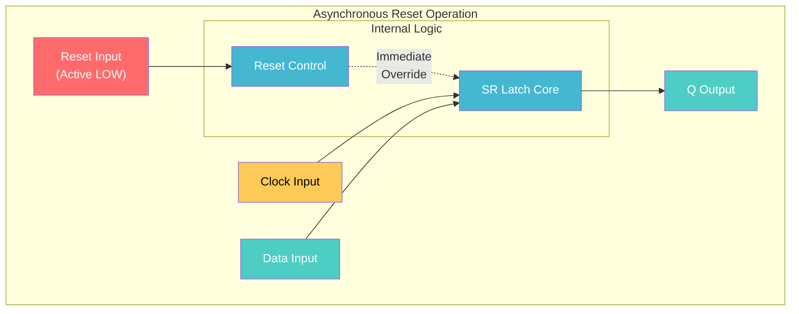
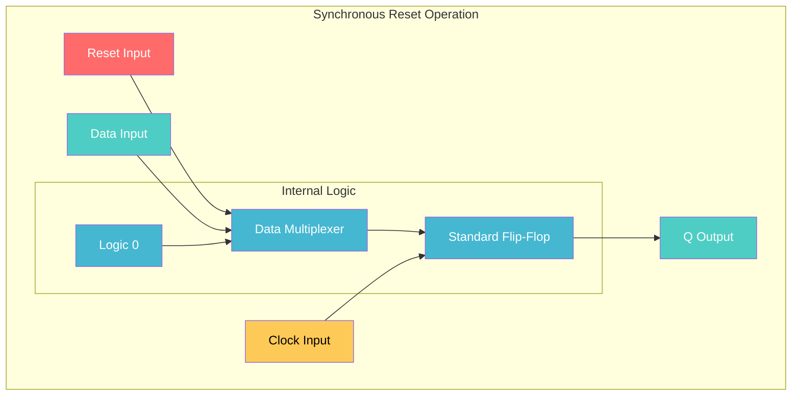
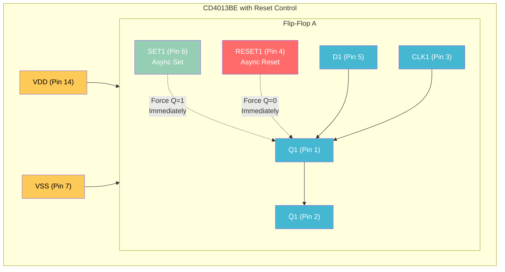
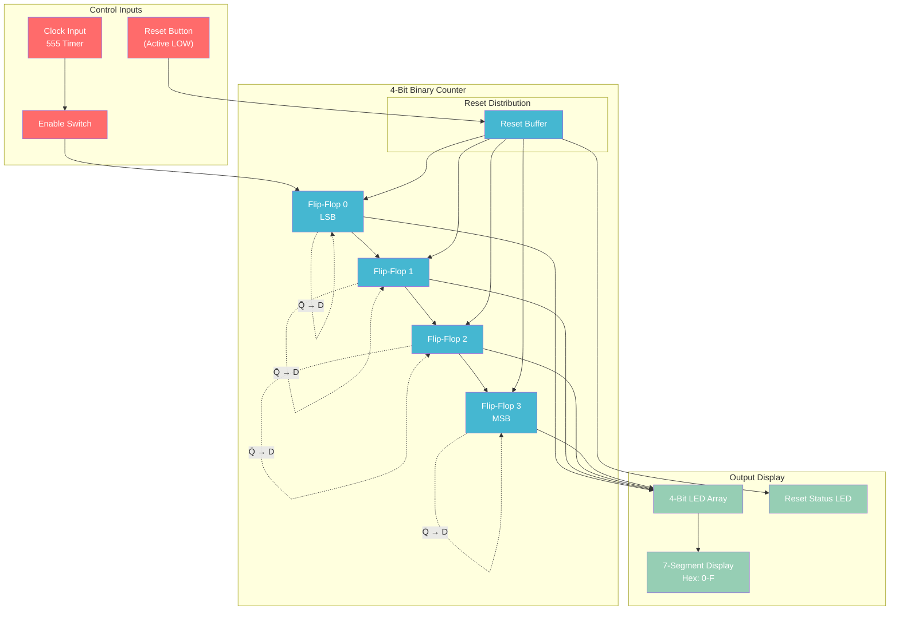
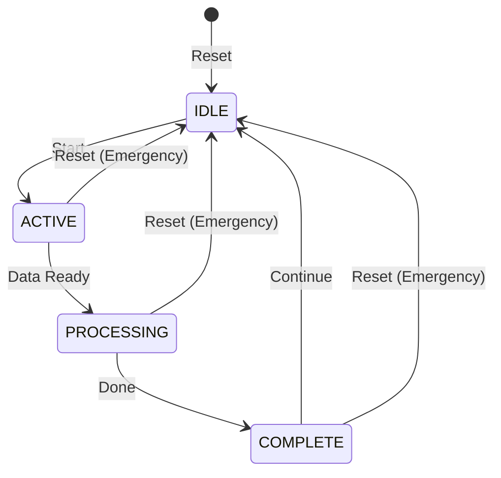
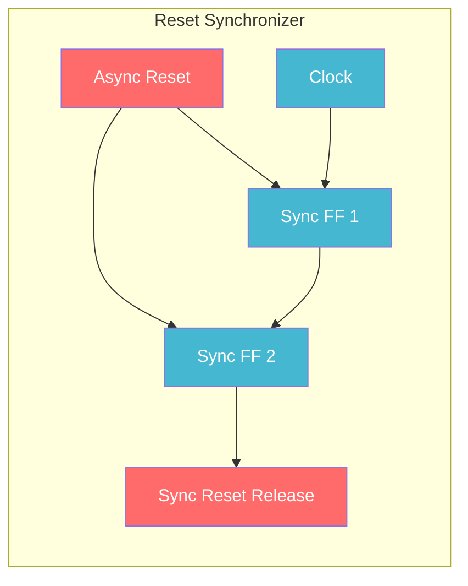

# Resettable Flip-Flop Tutorial - System Initialization and Control

Adding reset capability to flip-flops for system initialization, error recovery, and state machine control.

## Why Reset is Essential

**Problems without reset:**
- Flip-flops power up in random states
- No way to return to known initial condition
- Error states can persist indefinitely
- System startup behavior unpredictable

**Reset solves:**
- **Guaranteed initialization** to known state
- **Error recovery** from fault conditions
- **State machine control** for restart sequences
- **Pipeline flushing** in processor designs

## Types of Reset

### Asynchronous Reset

**Operation:** Reset takes effect immediately, regardless of clock
**Priority:** Reset overrides all other inputs
**Timing:** Independent of clock edges



### Synchronous Reset

**Operation:** Reset takes effect only on clock edge
**Priority:** Must wait for clock transition
**Timing:** Synchronized with system clock



## CD4013BE Built-in Reset

### IC Pin Configuration

The CD4013BE has built-in asynchronous SET and RESET pins:



**Truth Table for CD4013BE:**
| SET | RESET | CLK | D | Q | Action |
|-----|-------|-----|---|---|--------|
| 0 | 0 | X | X | 1 | **Forbidden** (both active) |
| 0 | 1 | X | X | Q(prev) | **Normal operation** |
| 1 | 0 | X | X | 0 | **Async Reset** |
| 1 | 1 | ↑ | 0 | 0 | **Clock edge, store D** |
| 1 | 1 | ↑ | 1 | 1 | **Clock edge, store D** |

**Note:** SET and RESET are **active LOW** on CD4013BE

## Project: 4-Bit Resettable Counter

### System Architecture



## Build Instructions

### Components Required

| Component | Quantity | Source | Usage |
|-----------|----------|--------|-------|
| CD4013BE | 2 | Silicon Ark | 4 flip-flops |
| CD4511BE | 1 | Silicon Ark | 7-segment decoder |
| 74HC04 | 1 | Silicon Ark | Reset buffering |
| NE555 | 1 | ELEGOO Kit | Clock source |
| Push button | 1 | ELEGOO Kit | Reset control |
| Toggle switch | 1 | Silicon Ark MS244 | Enable control |
| 7-segment display | 1 | Add to order | Hex display |
| LEDs | 5 | ELEGOO Kit | Binary + status |
| Resistors | Various | ELEGOO Kit | Current limiting |

### Step 1: Reset Control Circuit

**Reset button setup:**
1. Connect one side of push button to GND
2. Connect other side to +5V via 10kΩ pull-up resistor
3. Button output provides active-LOW reset signal
4. Add 0.1µF capacitor across button for debouncing

**Reset distribution:**
1. Use 74HC04 buffer to strengthen reset signal
2. Connect buffered reset to all RESET pins (Pin 4, Pin 10)
3. Ensure all flip-flops receive simultaneous reset

### Step 2: Counter Implementation

**Flip-flop configuration:**
```
FF0 (LSB): CD4013BE #1, Flip-Flop A
- D (Pin 5) ← Q̄ (Pin 2) [feedback for counting]
- CLK (Pin 3) ← Clock input
- RESET (Pin 4) ← Reset distribution

FF1: CD4013BE #1, Flip-Flop B  
- D (Pin 9) ← Q̄ (Pin 12) [feedback for counting]
- CLK (Pin 11) ← FF0 output
- RESET (Pin 10) ← Reset distribution

FF2: CD4013BE #2, Flip-Flop A
- Similar connections with FF1 output as clock

FF3 (MSB): CD4013BE #2, Flip-Flop B
- Similar connections with FF2 output as clock
```

**SET pin connections:**
1. Connect all SET pins (Pin 6, Pin 8) to +5V (inactive)
2. This disables the SET function, using only RESET

### Step 3: Display System

**Binary LED display:**
1. Connect each Q output to LED via 220Ω resistor
2. Arrange in binary order: Q0, Q1, Q2, Q3
3. Use different colored LEDs for easy reading

**7-segment hex display:**
1. Connect counter outputs to CD4511BE inputs (A, B, C, D)
2. Connect CD4511BE outputs to 7-segment display
3. Add current limiting resistors for each segment
4. Shows counter value as hex digit (0-F)

**Reset status indicator:**
1. Connect reset signal to red LED via 220Ω resistor
2. LED illuminates when reset is active
3. Provides visual feedback of reset state

## Demonstration Sequences

### Basic Reset Operation

**Power-up sequence:**
1. Apply power to circuit
2. Observe random initial state (LEDs show unpredictable pattern)
3. Press reset button
4. **Result:** All LEDs turn OFF, display shows 0

**Reset during counting:**
1. Enable counter, let it count to any value (e.g., 1011 = B)
2. Press reset button while counting
3. **Result:** Counter immediately jumps to 0000, continues from there

### Reset Timing Analysis

**Asynchronous behavior:**
1. Set up oscilloscope on counter output and reset signal
2. Press reset at random times during counting
3. **Observe:** Reset takes effect immediately, not waiting for clock

**Reset priority demonstration:**
1. Hold data inputs HIGH (trying to store 1111)
2. Assert reset while attempting to store data
3. **Result:** Reset overrides data inputs, output remains 0000

### Advanced Reset Features

**Power-on reset circuit:**
1. Add RC circuit to generate reset pulse at power-up
2. 10µF capacitor + 100kΩ resistor create ~1 second reset
3. Ensures known startup state without manual reset

**Reset release synchronization:**
1. Add flip-flop to synchronize reset release to clock
2. Prevents metastability during reset release
3. Professional technique for reliable operation

## Reset Implementation Comparison

| Aspect | Asynchronous Reset | Synchronous Reset |
|--------|-------------------|-------------------|
| **Response Time** | Immediate | Next clock edge |
| **Power Consumption** | Lower | Higher |
| **Timing Constraints** | Fewer | More complex |
| **Metastability Risk** | Higher | Lower |
| **Implementation** | Simple | Requires additional logic |
| **Use Cases** | Emergency stop, power-up | Normal operation control |

## Real-World Applications

### Microprocessor Reset Systems

**CPU reset sequence:**
1. **External reset** clears all processor state
2. **Program counter** reset to boot vector (e.g., 0xFFFF0000)
3. **Pipeline registers** flushed to known states
4. **Cache controllers** initialized to empty state

**Reset types in processors:**
- **Power-on reset**: Cold boot initialization
- **Warm reset**: Software-initiated restart
- **Watchdog reset**: Automatic recovery from hangs

### State Machine Control

**Finite state machine reset:**


**Pipeline control in processors:**
- **Flush signal** resets all pipeline registers
- **Branch misprediction** recovery
- **Exception handling** requires pipeline reset

### IoT Device Applications

**Sensor data acquisition:**
- **Measurement reset** between sensor readings
- **Calibration sequence** initialization
- **Error recovery** from sensor faults

**Communication protocol reset:**
- **UART reset** clears transmit/receive buffers
- **SPI reset** returns to idle state
- **WiFi reset** reinitializes connection state

## Advanced Reset Techniques

### Reset Synchronization

**Problem:** Asynchronous reset release can cause metastability
**Solution:** Synchronize reset release to clock edge



### Multi-Domain Reset

**Different reset requirements:**
- **Core logic**: Fast asynchronous reset
- **I/O interfaces**: Synchronized reset
- **Clock domains**: Domain-specific reset trees

**Reset hierarchy:**
```
Master Reset → Core Reset → Subsystem Resets → Individual Module Resets
```

## Troubleshooting

### Common Reset Issues

**Reset not working:**
- Check active LOW vs active HIGH polarity
- Verify reset signal reaches all flip-flops
- Test reset button mechanical operation

**Partial reset:**
- Some flip-flops not connected to reset
- Reset signal too weak to drive multiple inputs
- Power supply drooping during reset

**Reset timing problems:**
- Reset released too quickly
- Clock running during reset
- Metastability at reset release

**Erratic behavior after reset:**
- Floating inputs on unused pins
- Missing pull-up/pull-down resistors
- Power supply noise during reset sequence

### Debug Methodology

**Systematic testing:**
1. **Test reset signal** with voltmeter/logic probe
2. **Verify individual flip-flop** reset behavior
3. **Check reset distribution** to all components
4. **Measure reset timing** with oscilloscope

## Learning Outcomes

### Technical Understanding

**Reset design principles:**
- When to use asynchronous vs synchronous reset
- Reset distribution and signal integrity
- Timing considerations for reliable operation

**System initialization:**
- Importance of known startup states
- Error recovery mechanisms
- Professional reset circuit design

### Practical Skills

**Circuit construction:**
- Reset control circuit implementation
- Multi-component reset distribution
- Testing and verification techniques

**System design:**
- Reset hierarchy planning
- Timing analysis for reset sequences
- Integration with larger digital systems

This resettable flip-flop tutorial adds essential system control capabilities to your digital design toolkit, demonstrating how professional digital systems ensure reliable initialization and recovery from error conditions.
