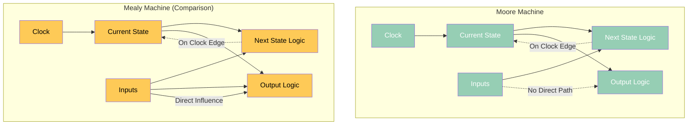
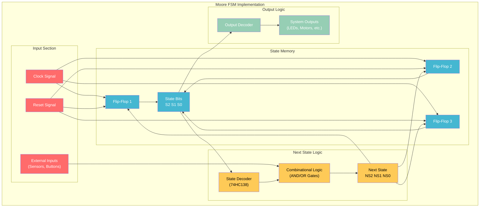
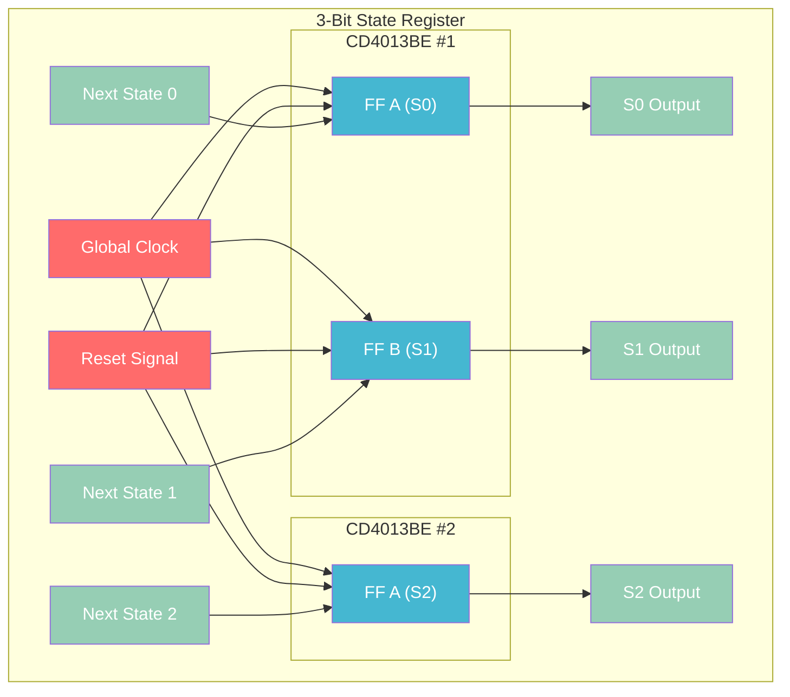

# Moore Finite State Machine Tutorial - Sequential Logic Control

Building Moore finite state machines using your discrete components to create intelligent sequential control systems.

## What is a Moore FSM?

**Moore Machine Definition:**
- **Outputs depend only on current state** (not on inputs)
- **State changes** triggered by clock edges and input conditions
- **Predictable outputs** - same state always produces same outputs
- **Stable operation** - outputs change only after state transitions

### Moore vs Mealy Comparison



**Key Difference:** Moore outputs are stable and depend only on state, making them ideal for control applications.

## Moore FSM Implementation Structure

### General Architecture



## Project: Traffic Light Controller

### State Diagram

```mermaid
stateDiagram-v2
    [*] --> RED
    
    state RED {
        RED : Red Light ON
        RED : Green/Yellow OFF
        RED : Timer 30 seconds
    }
    
    state REDYELLOW {
        REDYELLOW : Red + Yellow
        REDYELLOW : Green OFF
        REDYELLOW : Timer 5 seconds
    }
    
    state GREEN {
        GREEN : Green Light ON
        GREEN : Red/Yellow OFF
        GREEN : Timer 25 seconds
    }
    
    state YELLOW {
        YELLOW : Yellow Light ON
        YELLOW : Red/Green OFF
        YELLOW : Timer 5 seconds
    }
    
    RED --> REDYELLOW : Timer expires
    REDYELLOW --> GREEN : Timer expires
    GREEN --> YELLOW : Timer expires
    YELLOW --> RED : Timer expires
```

### State Encoding

| State | S2 | S1 | S0 | Red | Yellow | Green |
|-------|----|----|----|----|--------|-------|
| RED | 0 | 0 | 0 | 1 | 0 | 0 |
| RED+YELLOW | 0 | 0 | 1 | 1 | 1 | 0 |
| GREEN | 0 | 1 | 0 | 0 | 0 | 1 |
| YELLOW | 0 | 1 | 1 | 0 | 1 | 0 |
| UNUSED | 1 | X | X | 0 | 0 | 0 |

## Build Instructions

### Components Required

| Component | Quantity | Source | Usage |
|-----------|----------|--------|-------|
| CD4013BE | 2 | Silicon Ark | State memory (3 flip-flops) |
| 74HC138 | 1 | Silicon Ark | State decoder |
| 74HC08 | 1 | Silicon Ark | AND logic |
| 74HC32 | 1 | Silicon Ark | OR logic |
| CD4060BE | 1 | Silicon Ark | Timer/counter |
| LEDs (R/Y/G) | 3 | ELEGOO Kit | Traffic lights |
| Push button | 1 | ELEGOO Kit | Manual advance |
| Toggle switch | 1 | Silicon Ark MS244 | Auto/manual mode |
| Resistors | Various | ELEGOO Kit | Current limiting |

### Step 1: State Memory Implementation

**3-bit state register using CD4013BE:**
```
State Bit 0 (S0): CD4013BE #1, Flip-Flop A
- D input: Next state logic output NS0
- Clock: Global clock signal
- Reset: Master reset

State Bit 1 (S1): CD4013BE #1, Flip-Flop B  
- D input: Next state logic output NS1
- Clock: Global clock signal
- Reset: Master reset

State Bit 2 (S2): CD4013BE #2, Flip-Flop A
- D input: Next state logic output NS2
- Clock: Global clock signal  
- Reset: Master reset
```

### Step 2: State Decoder

**74HC138 3-to-8 decoder configuration:**
```
Inputs: S2, S1, S0 (current state bits)
Outputs: 8 decoded states (only 4 used)
- Y0: RED state (000)
- Y1: RED+YELLOW state (001)  
- Y2: GREEN state (010)
- Y3: YELLOW state (011)
- Y4-Y7: Unused states
```

### Step 3: Next State Logic

**State transition logic:**
```
NS0 = (RED) + (GREEN)
    = Y0 + Y2
    
NS1 = (REDYELLOW) + (YELLOW)  
    = Y1 + Y3
    
NS2 = 0 (always, since we only use 4 states)
```

**Implementation using 74HC32 (OR gates):**
- OR Gate 1: Y0 + Y2 → NS0
- OR Gate 2: Y1 + Y3 → NS1
- NS2: Tie to ground (always 0)

### Step 4: Output Logic (Moore Outputs)

**Traffic light outputs based on state only:**
```
RED LED = (RED state) + (RED+YELLOW state)
        = Y0 + Y1
        
YELLOW LED = (RED+YELLOW state) + (YELLOW state)
           = Y1 + Y3
           
GREEN LED = (GREEN state)
          = Y2
```

**Implementation:**
- Red LED: Connect Y0 and Y1 through OR gate
- Yellow LED: Connect Y1 and Y3 through OR gate  
- Green LED: Connect directly to Y2

### Step 5: Timing Control

**Auto/Manual mode selection:**
- **Auto mode**: CD4060BE counter provides regular clock pulses
- **Manual mode**: Push button provides clock pulses
- **Mode switch**: Toggle between auto and manual timing

## Detailed Circuit Implementation

### State Memory Section



### Complete Wiring Table

| Connection | From | To | Purpose |
|------------|------|----|---------| 
| **State Memory** | | | |
| Clock | Global Clock | CD4013BE Pins 3,11 (both ICs) | State transitions |
| Reset | Reset Button | CD4013BE Pins 4,10 (both ICs) | System initialization |
| NS0 → S0 | OR Gate Output | CD4013BE #1 Pin 5 | Next state to current |
| NS1 → S1 | OR Gate Output | CD4013BE #1 Pin 9 | Next state to current |
| NS2 → S2 | Ground | CD4013BE #2 Pin 5 | Always 0 |
| **State Decoder** | | | |
| S0 | CD4013BE #1 Pin 1 | 74HC138 Pin 1 | State bit 0 |
| S1 | CD4013BE #1 Pin 13 | 74HC138 Pin 2 | State bit 1 |
| S2 | CD4013BE #2 Pin 1 | 74HC138 Pin 3 | State bit 2 |
| **Next State Logic** | | | |
| Y0 (RED) | 74HC138 Pin 15 | 74HC32 Pin 1 | RED → RED+YELLOW |
| Y2 (GREEN) | 74HC138 Pin 13 | 74HC32 Pin 2 | GREEN → YELLOW |
| Y1 (R+Y) | 74HC138 Pin 14 | 74HC32 Pin 4 | R+Y → GREEN |
| Y3 (YELLOW) | 74HC138 Pin 12 | 74HC32 Pin 5 | YELLOW → RED |

## Testing and Demonstration

### Power-Up Sequence

1. **Apply power** to all circuits
2. **Press reset** to initialize to RED state (000)
3. **Verify initial state**: Red LED ON, others OFF
4. **Check state bits**: S2=0, S1=0, S0=0

### Manual Stepping

**Manual mode testing:**
1. Set mode switch to MANUAL
2. Press clock button once
3. **Expected transition**: RED → RED+YELLOW
4. **Verify outputs**: Red LED + Yellow LED both ON
5. **Check state bits**: S2=0, S1=0, S0=1

**Continue sequence:**
- Step 3: RED+YELLOW → GREEN (only Green LED)
- Step 4: GREEN → YELLOW (only Yellow LED)  
- Step 5: YELLOW → RED (only Red LED, cycle repeats)

### Automatic Operation

**Auto mode testing:**
1. Set mode switch to AUTO
2. **CD4060BE timer** generates regular clock pulses
3. **Observe continuous cycling** through all states
4. **Verify timing**: Each state holds for programmed duration

### State Verification

**Logic analyzer connections:**
- Channel 0: S0 (LSB)
- Channel 1: S1
- Channel 2: S2 (MSB)
- Channel 3: Clock signal
- Channels 4-6: Red, Yellow, Green outputs

**Expected timing diagram:**
```
Clock:   ↑___↑___↑___↑___↑___
S2 S1 S0: 000 001 010 011 000
Red:     ████████____█████████
Yellow:  ____████____████____
Green:   ________████________
```

## Advanced Features

### Emergency Override

**Pedestrian crossing button:**
```
Emergency Input → Immediate transition to RED state
Implementation: Additional reset logic that forces state to 000
```

**Circuit modification:**
- Add push button for emergency input
- OR emergency signal with normal reset
- Provides immediate safety override

### State Machine Extensions

**Additional states for complex intersections:**
- **All Red**: Safety gap between conflicting movements
- **Left Turn**: Protected left turn phases
- **Pedestrian**: Dedicated pedestrian crossing time

**Implementation:**
- Expand to 4-bit state register (16 possible states)
- Add additional output logic for new signals
- More complex next state logic

### Fault Detection

**State machine monitoring:**
```
Invalid State Detection: If S2=1, force reset to RED
Implementation: Decoder output Y4-Y7 OR'd together → Reset
```

**Watchdog timer:**
- Separate timer circuit monitors state changes
- If no state change within timeout, force reset
- Prevents stuck state conditions

## Real-World Applications

### Microprocessor Control Units

**CPU state machines:**
- **Instruction fetch**: Request → Wait → Decode
- **Memory access**: Setup → Read/Write → Complete
- **Interrupt handling**: Normal → Save → Service → Restore

**Implementation in processors:**
- State bits stored in control registers
- Next state logic implemented in microcode
- Moore outputs control datapath operations

### IoT Device State Control

**Sensor data acquisition:**
```
States: IDLE → MEASURE → PROCESS → TRANSMIT → IDLE
Outputs: Enable sensor, Start ADC, Send data, Sleep mode
```

**Power management:**
```  
States: ACTIVE → SLEEP → DEEP_SLEEP → WAKE → ACTIVE
Outputs: Clock enable, Voltage regulator, Wake interrupt
```

### Communication Protocol Controllers

**UART transmitter FSM:**
```
States: IDLE → START → DATA0-7 → PARITY → STOP → IDLE
Outputs: TX line level, Shift enable, Parity generate
```

**SPI controller FSM:**
```
States: IDLE → SELECT → CLOCK → DESELECT → IDLE  
Outputs: Chip select, Clock enable, Data valid
```

## Design Methodology

### State Diagram to Implementation

**Step 1: State enumeration**
- List all required states
- Assign binary encoding (minimize flip-flops)
- Plan for unused state handling

**Step 2: Transition conditions**
- Define input conditions for each transition
- Create transition table
- Simplify logic expressions

**Step 3: Output specification**
- List outputs for each state (Moore principle)
- Create output table
- Implement output logic

**Step 4: Verification**
- Simulate state machine behavior
- Test all transition paths
- Verify output correctness

### Optimization Techniques

**State encoding optimization:**
- **Binary encoding**: Minimum flip-flops (n states → log₂(n) bits)
- **One-hot encoding**: Fast decoding (n states → n flip-flops)
- **Gray code**: Minimum transitions between adjacent states

**Logic minimization:**
- Use Karnaugh maps for next state logic
- Factor common terms in output logic
- Consider using ROMs for complex logic

## Troubleshooting

### Common FSM Issues

**Stuck in one state:**
- Check next state logic implementation
- Verify clock signal reaches state flip-flops
- Test input condition generation

**Wrong output patterns:**
- Verify output logic matches state table
- Check state bit connections to output decoder
- Test each state independently

**Random state changes:**
- Check for floating inputs on unused decoder pins
- Verify power supply decoupling
- Test clock signal integrity

**Reset problems:**
- Ensure reset reaches all state flip-flops
- Check reset polarity (active high/low)
- Verify reset timing and duration

### Debug Methodology

**Systematic testing approach:**
1. **Test state memory** - manually clock through states
2. **Verify state decoder** - check decoded outputs
3. **Test next state logic** - verify transitions
4. **Check output logic** - confirm Moore operation
5. **Full system test** - automatic operation

## Learning Outcomes

### Conceptual Understanding

**Sequential logic design:**
- State-based control system design
- Timing relationships in clocked systems
- Moore vs Mealy machine trade-offs

**System architecture:**
- Control unit design principles
- State machine implementation techniques
- Interface between control and datapath

### Practical Skills

**Digital system implementation:**
- Complex sequential circuit construction
- Multi-IC system integration
- Timing analysis and debugging

**Professional techniques:**
- State diagram to hardware translation
- Systematic design methodology
- Testing and verification procedures

This Moore FSM tutorial demonstrates how your discrete flip-flop and logic gate knowledge scales to intelligent control systems, providing the foundation for understanding processor control units and sophisticated digital system design.
